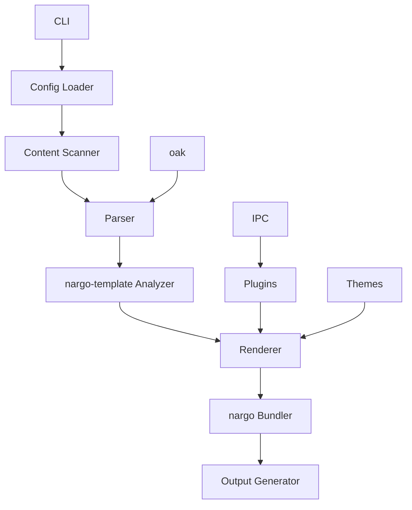

# Rusty SSG

A collection of high-performance, pure Rust implementations of popular static site generators, designed for exceptional speed and full compatibility with core features.

## Overview

Rusty SSG is a monorepo containing Rust reimplementations of various static site generators, offering significant performance improvements over their original counterparts while maintaining full compatibility with static features.

### 🎯 Key Features
- 🚀 **Blazing Fast**: Leveraging Rust's performance characteristics for lightning-fast builds
- 🎨 **Full Compatibility**: Maintains compatibility with original SSG features when using static functionality
- 🔧 **Extensible**: Plugin systems for each compiler
- 🛠 **Developer Friendly**: Great tooling and developer experience
- 📝 **Markdown Support**: Advanced Markdown parsing and rendering
- 🌍 **Cross-Platform**: Works on Windows, macOS, and Linux
- 📱 **Static-First**: Optimized for static site generation

## Compilers

### Astro
**Pure Rust implementation of Astro static site generator**
- Framework-agnostic approach with .astro components
- Supports React, Vue, Svelte, and plain HTML
- Component-based architecture

### Eleventy
**Pure Rust implementation of Eleventy static site generator**
- Multiple template engine support (Nunjucks, Markdown, HTML, Liquid, Handlebars, Mustache, EJS)
- Content-first approach
- Flexible configuration

### Gatsby
**Pure Rust implementation of Gatsby static site generator**
- React-based components
- GraphQL data layer
- Rich ecosystem of plugins and themes

### Hexo
**Pure Rust implementation of Hexo static site generator**
- Blog-focused design
- Theme system with hundreds of available themes
- Markdown-based content

### Hugo
**Pure Rust implementation of Hugo static site generator**
- Fast and flexible templating system
- Shortcode support
- Multiple configuration formats (TOML, YAML, JSON)

### Jekyll
**Pure Rust implementation of Jekyll static site generator**
- Liquid templating system
- Blog-focused features
- Theme compatibility

### MkDocs
**Pure Rust implementation of MkDocs static site generator**
- Documentation-focused design
- Beautiful themes
- Easy navigation configuration

### VitePress
**Pure Rust implementation of VitePress static site generator**
- Vue-powered documentation
- Modern design
- Markdown with Vue components

### VuePress
**Pure Rust implementation of VuePress static site generator**
- Vue-based architecture
- Documentation-focused
- Customizable themes

## Architecture

All compilers follow a modular architecture designed for performance and extensibility:

### Core Components

- **CLI**: Command-line interface for interacting with the compiler
- **Config Loader**: Reads and parses configuration files
- **Content Scanner**: Discovers and processes content files
- **Parser**: Converts source files to intermediate representation (uses oak)
- **nargo-template Analyzer**: Analyzes content and templates
- **Renderer**: Transforms intermediate representation to HTML
- **nargo Bundler**: Bundles and optimizes output files
- **Output Generator**: Writes final static files
- **Plugins**: Extend functionality with custom plugins (uses IPC mode)
- **Themes**: Provide reusable templates and styles
- **oak**: External library for parsing
- **IPC**: Inter-process communication for plugin system

## Performance

Rusty SSG compilers outperform their original counterparts by a significant margin:

- **Up to 10x faster** build times for medium to large sites
- **Lower memory usage** compared to original implementations
- **Parallel processing** of documents for improved performance
- **Efficient caching** to minimize rebuild times

## Contributing

We welcome contributions to Rusty SSG! 🤝

### Reporting Issues

If you find a bug or have a feature request, please [open an issue](https://github.com/doki-land/rusty-ssg/issues).

### Pull Requests

1. Fork the repository
2. Create a new branch
3. Make your changes
4. Run tests
5. Submit a pull request

### Code Style

Please follow the Rust style guide and use `cargo fmt` to format your code.

## Acknowledgements

Rusty SSG is inspired by the original static site generators and benefits from the Rust ecosystem, including the nargo and oak libraries.

## License

Rusty SSG is licensed under the AGPL-3.0 license. See [LICENSE](License.md) for more information.

---

Built with ❤️ in Rust

Happy static site generating! 🚀