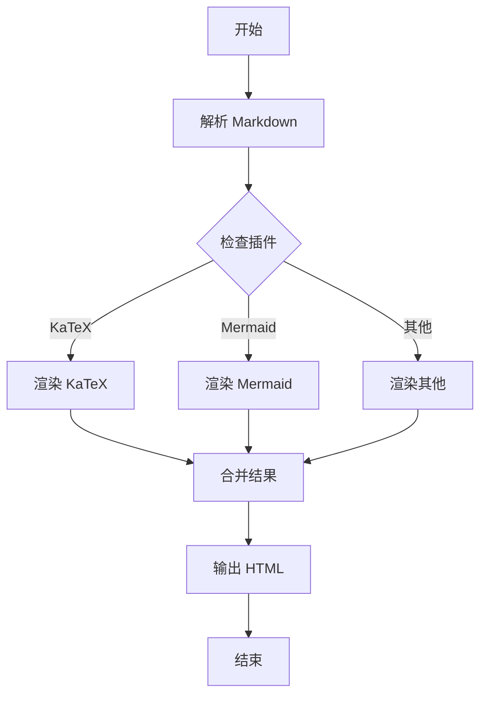
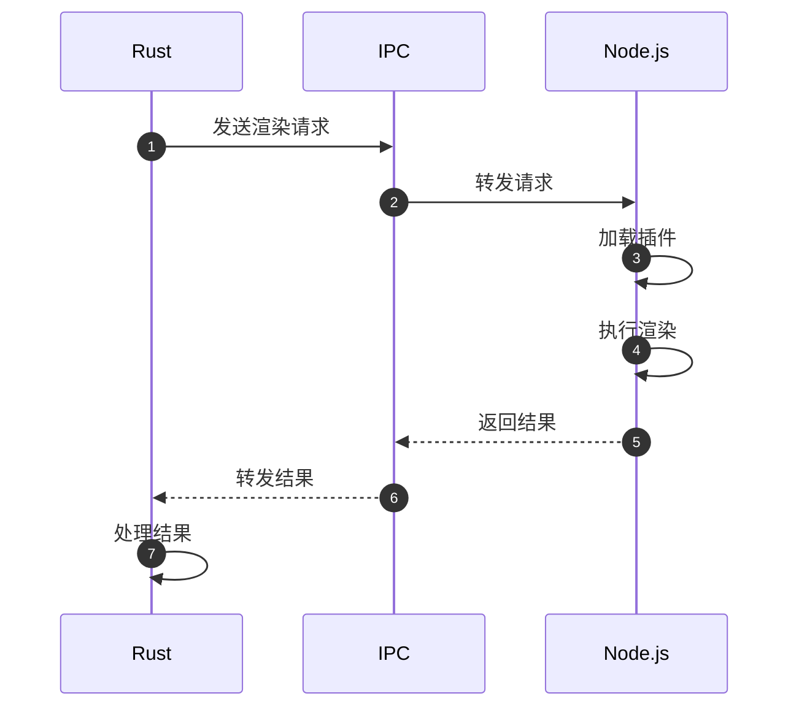
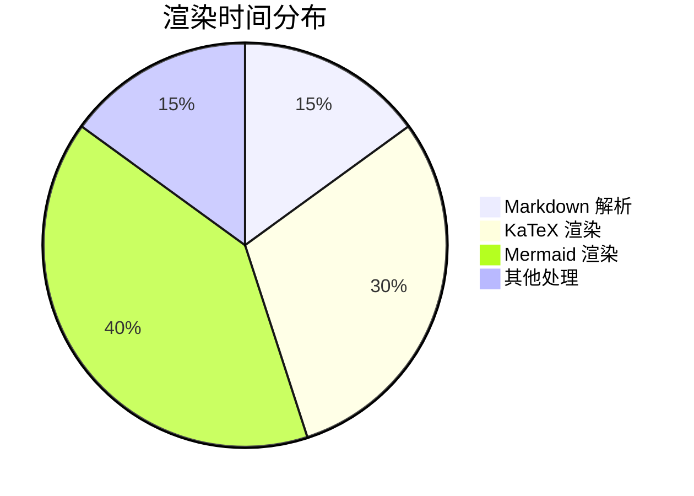
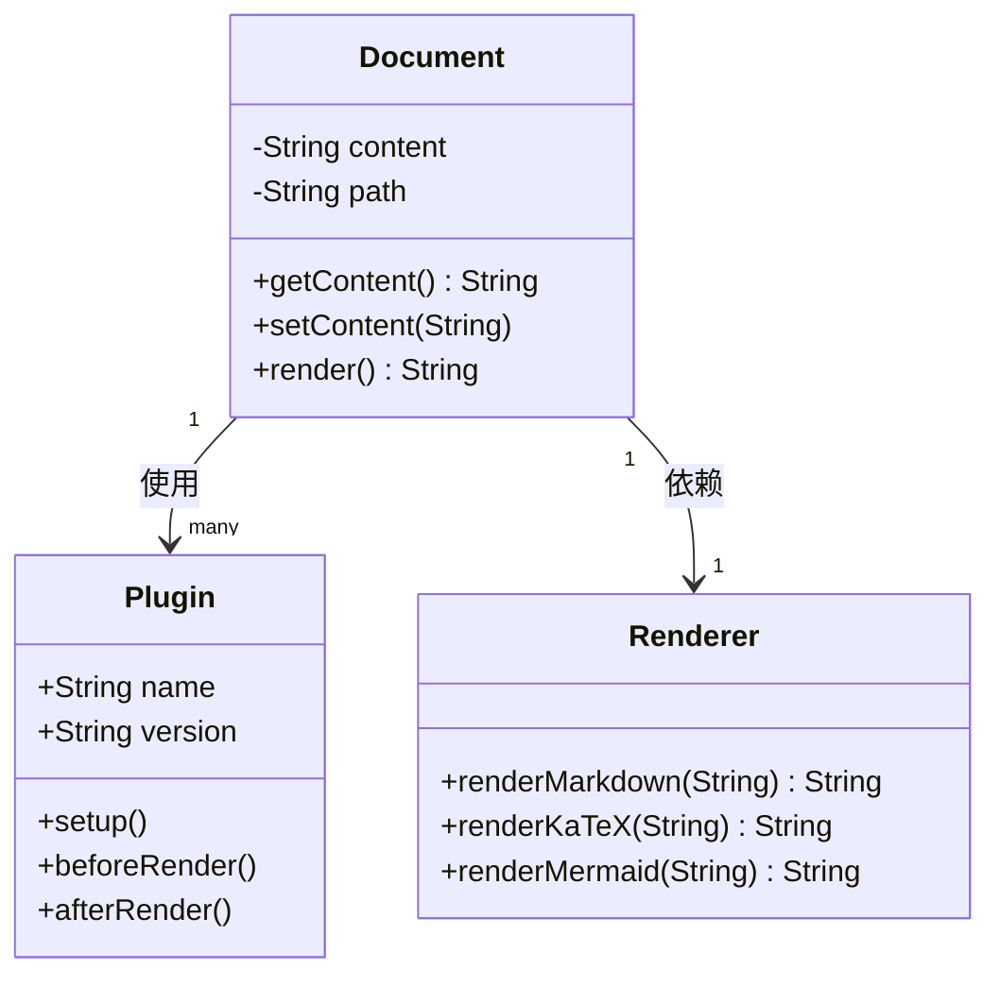

# 综合性能测试

这是一个同时包含 KaTeX 和 Mermaid 内容的综合测试文档。

## 简介

本文档用于测试 VuTeX 在处理复杂内容时的性能表现。

## 数学公式部分

首先是一些 KaTeX 公式：

$$
\sum_{i=1}^{n} i = \frac{n(n+1)}{2}
$$

行内公式：$f(x) = x^2 + 2x + 1$ 是一个二次函数。

$$
\frac{\partial}{\partial x}f(x) = 2x + 2
$$

## 流程图部分

然后是一个 Mermaid 流程图：

## 更多数学

$$
\prod_{k=1}^{n} k = n!
$$

$$
\sum_{n=0}^{\infty} \frac{x^n}{n!} = e^x
$$

## 序列图

## 矩阵公式

$$
\begin{pmatrix}
1 & 2 & 3 \\
4 & 5 & 6 \\
7 & 8 & 9
\end{pmatrix}
\times
\begin{pmatrix}
a \\
b \\
c
\end{pmatrix}
=
\begin{pmatrix}
a + 2b + 3c \\
4a + 5b + 6c \\
7a + 8b + 9c
\end{pmatrix}
$$

## 饼图

## 极限和积分

$$
\lim_{x \to 0} \frac{\sin x}{x} = 1
$$

$$
\int_{0}^{\infty} e^{-x^2} dx = \frac{\sqrt{\pi}}{2}
$$

## 类图

## 更多内容

我们添加更多内容来增加测试负载。

行内公式：$x_1, x_2, \dots, x_n$ 是样本数据。

$$
\bar{x} = \frac{1}{n} \sum_{i=1}^{n} x_i
$$

$$
\sigma^2 = \frac{1}{n} \sum_{i=1}^{n} (x_i - \bar{x})^2
$$
