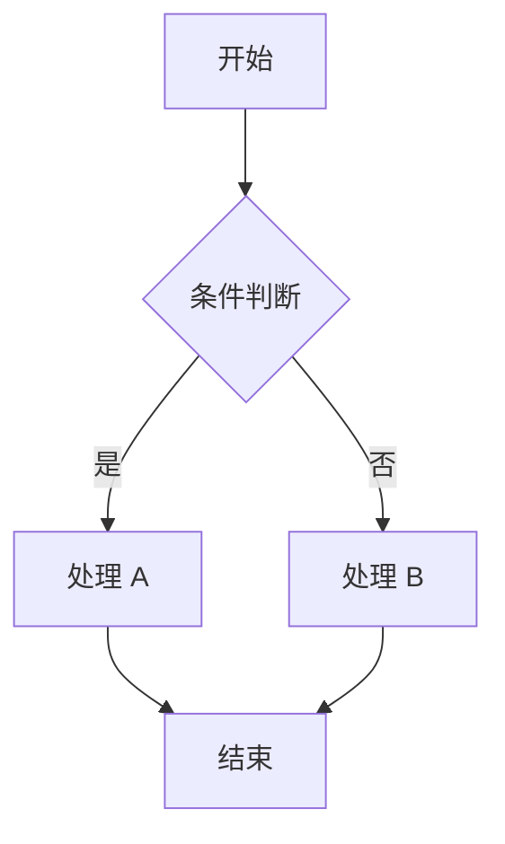
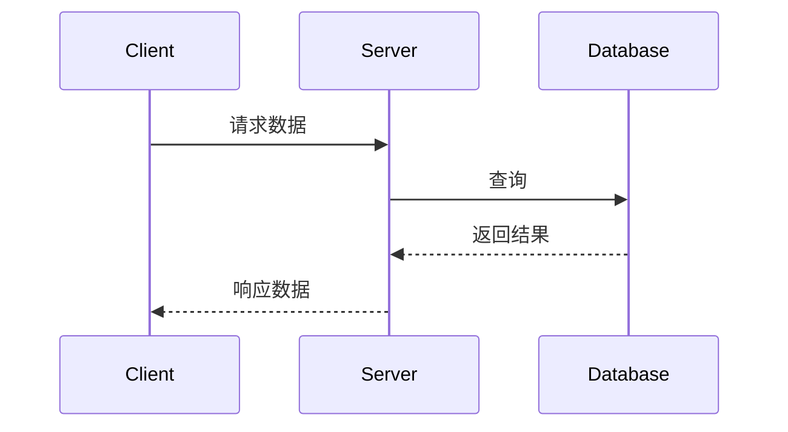
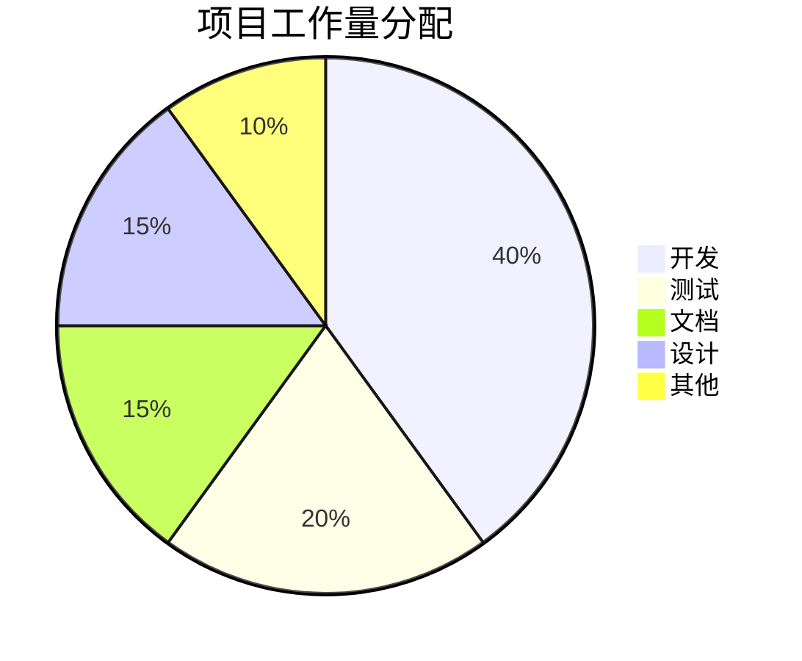
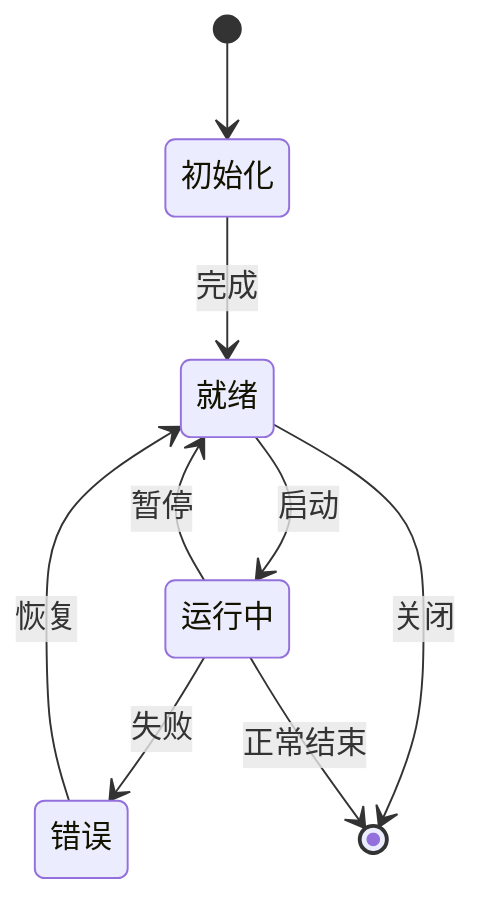
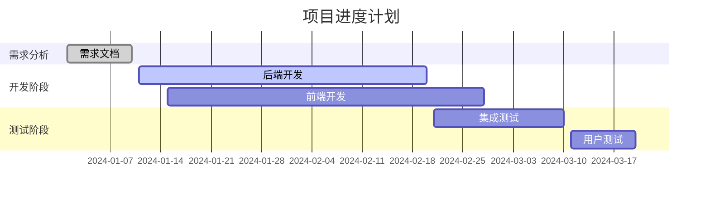
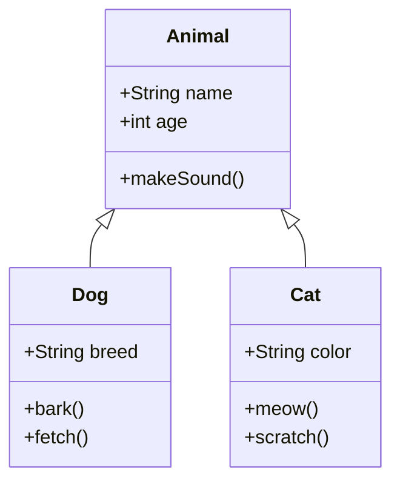
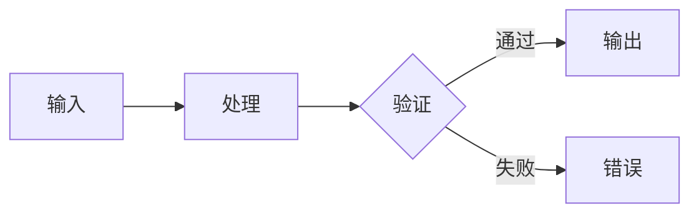
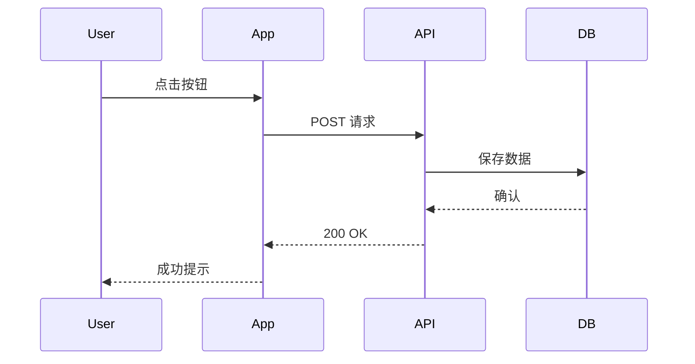

# Mermaid 性能测试

这是一个包含 Mermaid 图表的测试文档。

## 流程图

```mermaid
flowchart TD
    A[开始] --> B{条件判断}
    B -->|是| C[处理 A]
    B -->|否| D[处理 B]
    C --> E[结束]
    D --> E
```

## 序列图

```mermaid
sequenceDiagram
    participant Client
    participant Server
    participant Database
    
    Client->>Server: 请求数据
    Server->>Database: 查询
    Database-->>Server: 返回结果
    Server-->>Client: 响应数据
```

## 饼图

```mermaid
pie
    title 项目工作量分配
    "开发" : 40
    "测试" : 20
    "文档" : 15
    "设计" : 15
    "其他" : 10
```

## 状态图

```mermaid
stateDiagram-v2
    [*] --> 初始化
    初始化 --> 就绪 : 完成
    就绪 --> 运行中 : 启动
    运行中 --> 就绪 : 暂停
    运行中 --> 错误 : 失败
    错误 --> 就绪 : 恢复
    就绪 --> [*] : 关闭
    运行中 --> [*] : 正常结束
```

## 甘特图

```mermaid
gantt
    title 项目进度计划
    dateFormat  YYYY-MM-DD
    section 需求分析
    需求文档           :done,    des1, 2024-01-01, 2024-01-10
    section 开发阶段
    后端开发           :active,  dev1, 2024-01-11, 2024-02-20
    前端开发           :         dev2, 2024-01-15, 2024-02-28
    section 测试阶段
    集成测试           :         test1, 2024-02-21, 2024-03-10
    用户测试           :         test2, 2024-03-11, 2024-03-20
```

## 类图

```mermaid
classDiagram
    class Animal {
        +String name
        +int age
        +makeSound()
    }
    class Dog {
        +String breed
        +bark()
        +fetch()
    }
    class Cat {
        +String color
        +meow()
        +scratch()
    }
    Animal <|-- Dog
    Animal <|-- Cat
```

## 多个图表

第二个流程图：

```mermaid
flowchart LR
    A[输入] --> B[处理]
    B --> C{验证}
    C -->|通过| D[输出]
    C -->|失败| E[错误]
```

第二个序列图：

```mermaid
sequenceDiagram
    User->>App: 点击按钮
    App->>API: POST 请求
    API->>DB: 保存数据
    DB-->>API: 确认
    API-->>App: 200 OK
    App-->>User: 成功提示
```
