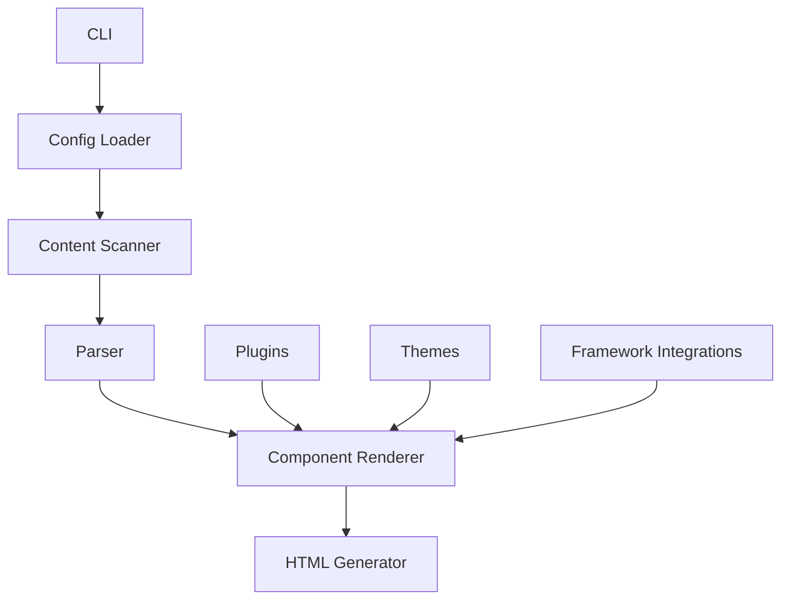

# Astro - Rust Implementation

## Overview

Astro is a blazingly fast static site generator, now implemented in Rust for even better performance and reliability. It's designed to help you build beautiful, modern websites with ease, combining the best of static site generation with the power of modern frameworks.

### Key Features
- 🚀 **Fast Builds**: Compile your site in seconds, not minutes
- 🎨 **Modern Templates**: Use Astro's unique component-based approach
- 📦 **Easy Deployment**: Generate static files that work anywhere
- 🔧 **Extensible**: Customize with plugins and integrations
- 🛠 **Developer Friendly**: Great tooling and developer experience
- 🌐 **Framework Agnostic**: Use React, Vue, Svelte, or plain HTML

## Installation

### From Crates.io

```bash
cargo install astro
```

### From Source

```bash
# Clone the repository
git clone https://github.com/rusty-ssg/astro.git

# Build and install
cd astro
cargo install --path .
```

## Usage

### Create a New Site

```bash
astro init my-site
cd my-site
```

### Develop Locally

```bash
astro dev
```

This will start a local development server with hot reloading, so you can see your changes in real-time.

### Build for Production

```bash
astro build
```

This will generate optimized static files in the `dist` directory, ready for deployment.

## Architecture

Astro follows a modular architecture designed for performance and extensibility:



### Core Components

- **CLI**: Command-line interface for interacting with the compiler
- **Config Loader**: Reads and parses Astro configuration files
- **Content Scanner**: Discovers and processes content files
- **Parser**: Converts Astro components and Markdown to intermediate representation
- **Component Renderer**: Renders components to static HTML
- **HTML Generator**: Writes final static files
- **Plugins**: Extend functionality with custom plugins
- **Themes**: Provide reusable templates and styles
- **Framework Integrations**: Support for React, Vue, Svelte, and more

## Project Structure

Here's an example project structure for an Astro site:

```
my-site/
├── src/                # Source files
│   ├── components/      # Astro components
│   │   ├── Header.astro
│   │   └── Footer.astro
│   ├── layouts/         # Layout components
│   │   └── Layout.astro
│   ├── pages/           # Page files
│   │   ├── index.astro
│   │   ├── about.astro
│   │   └── blog/
│   │       ├── index.astro
│   │       └── [slug].astro
│   └── styles/          # CSS files
│       └── global.css
├── public/              # Static assets
│   ├── images/
│   └── favicon.ico
├── astro.config.toml    # Configuration file
└── package.json         # For npm dependencies
```

## Configuration

Here's an example `astro.config.toml` file:

```toml
# Site settings
site = "https://example.com"
title = "My Awesome Astro Site"
description = "A description of my awesome Astro site"

# Build settings
outDir = "dist"
base = "/"

# Theme settings
theme = "@astrojs/theme-default"

# Plugin settings
[plugins]
enabled = ["@astrojs/mdx", "@astrojs/tailwind"]

# Markdown settings
[markdown]
extensions = ["md", "mdx"]
shikiConfig = {
  theme = "nord"
}
```

## Examples

### Example Astro Component

Here's an example of an Astro component:

```astro
---
// src/components/Header.astro
import { Astro } from 'astro';

export interface Props {
  title: string;
}

const { title } = Astro.props;
---

<header>
  <h1>{title}</h1>
  <nav>
    <a href="/">Home</a>
    <a href="/about">About</a>
    <a href="/blog">Blog</a>
  </nav>
</header>

<style>
  header {
    display: flex;
    justify-content: space-between;
    align-items: center;
    padding: 1rem;
    background-color: #f0f0f0;
  }
  
  h1 {
    margin: 0;
  }
  
  nav a {
    margin-left: 1rem;
    text-decoration: none;
    color: #333;
  }
</style>
```

### Example Blog Post

Here's an example of a blog post in Astro:

```markdown
---
title: "Getting Started with Astro"
date: 2024-01-01
author: "Your Name"
categories: ["tutorial", "getting-started"]
tags: ["astro", "static-site-generator"]
---

# Getting Started with Astro

Welcome to Astro! This is your first blog post.

## What is Astro?

Astro is a fast, modern static site generator that lets you use components from your favorite frameworks like React, Vue, and Svelte.

## Why Use Astro?

- It's blazingly fast
- It supports multiple frameworks
- It has a great developer experience
- It generates fully static sites

## Next Steps

1. Create more content
2. Add components from your favorite framework
3. Deploy your site

Happy coding!
```

## Compatibility Note

⚠️ **Important**: Astro provides 100% compatibility only when using static features. Dynamic features like client-side JavaScript may have limited support or require additional configuration.

## Plugins

Astro supports a wide range of plugins to extend functionality:

- **@astrojs/mdx**: Support for MDX files
- **@astrojs/tailwind**: Integration with Tailwind CSS
- **@astrojs/react**: React framework integration
- **@astrojs/vue**: Vue framework integration
- **@astrojs/svelte**: Svelte framework integration
- **@astrojs/image**: Optimized image handling

## Themes

Choose from a variety of built-in themes or create your own:

- **@astrojs/theme-default**: Clean, modern design
- **@astrojs/theme-blog**: Blog-focused theme
- **@astrojs/theme-docs**: Documentation-focused theme
- **@astrojs/theme-minimal**: Minimalist design

## Deployment

Astro generates static files that can be deployed anywhere:

### Netlify

```toml
# netlify.toml
[build]
  command = "astro build"
  publish = "dist"
```

### Vercel

```json
// vercel.json
{
  "buildCommand": "astro build",
  "outputDirectory": "dist"
}
```

### GitHub Pages

```yaml
# .github/workflows/deploy.yml
name: Deploy
on: [push]
jobs:
  deploy:
    runs-on: ubuntu-latest
    steps:
      - uses: actions/checkout@v3
      - uses: actions-rs/toolchain@v1
        with:
          toolchain: stable
      - run: cargo install astro
      - run: astro build
      - uses: peaceiris/actions-gh-pages@v3
        with:
          github_token: ${{ secrets.GITHUB_TOKEN }}
          publish_dir: ./dist
```

## Contribution Guidelines

We welcome contributions to Astro!

### Reporting Issues

If you find a bug or have a feature request, please [open an issue](https://github.com/rusty-ssg/astro/issues).

### Pull Requests

1. Fork the repository
2. Create a new branch
3. Make your changes
4. Run tests
5. Submit a pull request

### Code Style

Please follow the Rust style guide and use `cargo fmt` to format your code.

## License

Astro is licensed under the MIT License. See [LICENSE](LICENSE) for more information.

## Acknowledgements

Astro is inspired by the original Astro project and benefits from the Rust ecosystem.

---

Happy building with Astro! 🚀