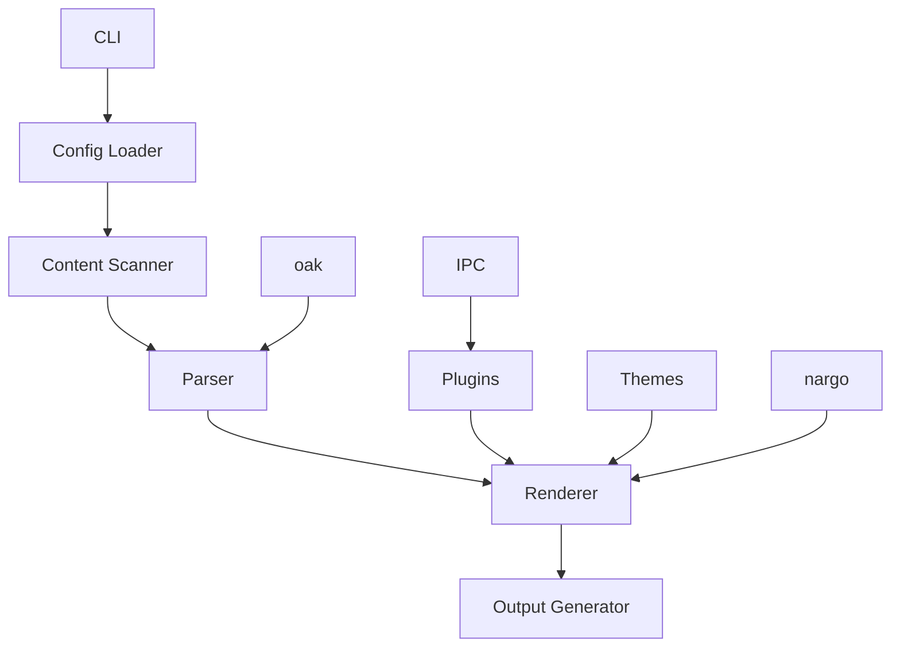

# Astro - Rust Reimplementation

## Overview

Astro is a blazingly fast static site generator, now reimplemented in Rust for even better performance and reliability. It's designed to help you build beautiful, modern websites with ease, combining the best of static site generation with the power of modern frameworks.

### 🎯 Key Features
- 🚀 **Fast Builds**: Compile your site in seconds, not minutes
- 🎨 **Modern Templates**: Use Astro's unique component-based approach with .astro files
- 📦 **Easy Deployment**: Generate static files that work anywhere
- 🔧 **Extensible**: Customize with plugins and integrations
- 🛠 **Developer Friendly**: Great tooling and developer experience
- 🌐 **Framework Agnostic**: Use React, Vue, Svelte, or plain HTML
- 🌍 **Cross-Platform**: Works on Windows, macOS, and Linux
- 📱 **100% Compatible**: Full compatibility when using static features

## Installation

### From Crates.io

```bash
cargo install astro
```

### From Source

```bash
# Clone the repository
git clone https://github.com/doki-land/rusty-ssg.git

# Build and install
cd rusty-ssg/compilers/astro
git checkout dev
cargo install --path .
```

## Usage

### Create a New Site

```bash
astro init my-site
cd my-site
```

### Develop Locally

```bash
astro dev
```

This will start a local development server with hot reloading, so you can see your changes in real-time.

### Build for Production

```bash
astro build
```

This will generate optimized static files in the `dist` directory, ready for deployment.

## Architecture

Astro follows a modular architecture designed for performance and extensibility, leveraging external libraries for enhanced functionality:



### Core Components

- **CLI**: Command-line interface for interacting with the compiler
- **Config Loader**: Reads and parses Astro configuration files
- **Content Scanner**: Discovers and processes content files
- **Parser**: Converts source files to intermediate representation (uses oak)
- **Renderer**: Transforms intermediate representation to HTML
- **Output Generator**: Writes final static files
- **Plugins**: Extend functionality with custom plugins (uses IPC mode)
- **Themes**: Provide reusable templates and styles
- **nargo**: External library with analysis engines and bundlers
- **oak**: External library for parsing
- **IPC**: Inter-process communication for plugin system

## Configuration

Here's an example `astro.config.mjs` file:

```javascript
// astro.config.mjs
import { defineConfig } from 'astro';

export default defineConfig({
  // Site settings
  site: 'https://example.com',
  base: '/',
  
  // Build settings
  output: 'static',
  outDir: './dist',
  
  // Integrations
  integrations: [
    // Add integrations here
  ],
  
  // Markdown settings
  markdown: {
    shikiConfig: {
      theme: 'github-dark',
    },
  },
  
  // Server settings
  server: {
    port: 3000,
    host: true,
  },
});
```

## Examples

### Example Astro Component

Here's an example of an Astro component:

```astro
---
// src/components/Header.astro
const { title } = Astro.props;
---

<header>
  <h1>{title}</h1>
  <nav>
    <a href="/">Home</a>
    <a href="/about">About</a>
    <a href="/blog">Blog</a>
  </nav>
</header>

<style>
  header {
    display: flex;
    justify-content: space-between;
    align-items: center;
    padding: 1rem;
    background-color: #f0f0f0;
  }
  
  h1 {
    margin: 0;
  }
  
  nav a {
    margin-left: 1rem;
    text-decoration: none;
    color: #333;
  }
</style>
```

### Example Blog Post

Here's an example of a blog post in Astro:

```markdown
---
title: "Getting Started with Astro"
date: 2024-01-01
author: "Your Name"
categories: ["tutorial", "getting-started"]
tags: ["astro", "static-site-generator"]
---

# Getting Started with Astro

Welcome to Astro! This is your first blog post.

## What is Astro?

Astro is a fast, modern static site generator that lets you use your favorite JavaScript frameworks while generating fully static HTML.

## Why Use Astro?

- It's blazingly fast
- It supports multiple frameworks (React, Vue, Svelte)
- It has a unique component-based approach
- It's 100% compatible with static features

## Next Steps

1. Create more content
2. Customize your components
3. Add integrations
4. Deploy your site

Happy coding! 🎉
```

## Compatibility Note

⚠️ **Important**: Astro provides 100% compatibility only when using static features. Dynamic features may have limited support or require additional configuration.

## Plugins

Astro supports a wide range of plugins to extend functionality (using IPC mode):

- 📊 **@astrojs/katex**: Render mathematical formulas
- 🎨 **@astrojs/prism**: Syntax highlighting for code blocks
- 📈 **@astrojs/mermaid**: Render diagrams and flowcharts
- 🔍 **@astrojs/google-analytics**: Add Google Analytics tracking
- 🗺️ **@astrojs/sitemap**: Generate sitemap.xml
- 📱 **@astrojs/pwa**: Add PWA support

## Themes

Choose from a variety of built-in themes or create your own:

- 🎨 **default**: Clean, modern design
- 🌙 **dark**: Dark mode theme
- 📦 **minimal**: Minimalist design
- 📝 **blog**: Blog-focused theme

## Deployment

Astro generates static files that can be deployed anywhere:

### Netlify

```toml
# netlify.toml
[build]
  command = "astro build"
  publish = "dist"
```

### Vercel

```json
// vercel.json
{
  "buildCommand": "astro build",
  "outputDirectory": "dist"
}
```

### GitHub Pages

```yaml
# .github/workflows/deploy.yml
name: Deploy
on: [push]
jobs:
  deploy:
    runs-on: ubuntu-latest
    steps:
      - uses: actions/checkout@v3
      - uses: actions-rs/toolchain@v1
        with:
          toolchain: stable
      - run: cargo install astro
      - run: astro build
      - uses: peaceiris/actions-gh-pages@v3
        with:
          github_token: ${{ secrets.GITHUB_TOKEN }}
          publish_dir: ./dist
```

## Contribution Guidelines

We welcome contributions to Astro! 🤝

### Reporting Issues

If you find a bug or have a feature request, please [open an issue](https://github.com/doki-land/rusty-ssg/issues).

### Pull Requests

1. Fork the repository
2. Create a new branch
3. Make your changes
4. Run tests
5. Submit a pull request

### Code Style

Please follow the Rust style guide and use `cargo fmt` to format your code.

## Acknowledgements

Astro is inspired by the original Astro project and benefits from the Rust ecosystem, including the nargo and oak libraries.

## License

Astro is licensed under the terms specified in the LICENSE file. See [LICENSE](https://github.com/doki-land/rusty-ssg/blob/dev/License.md) for more information.

---

Happy building with Astro! 🚀