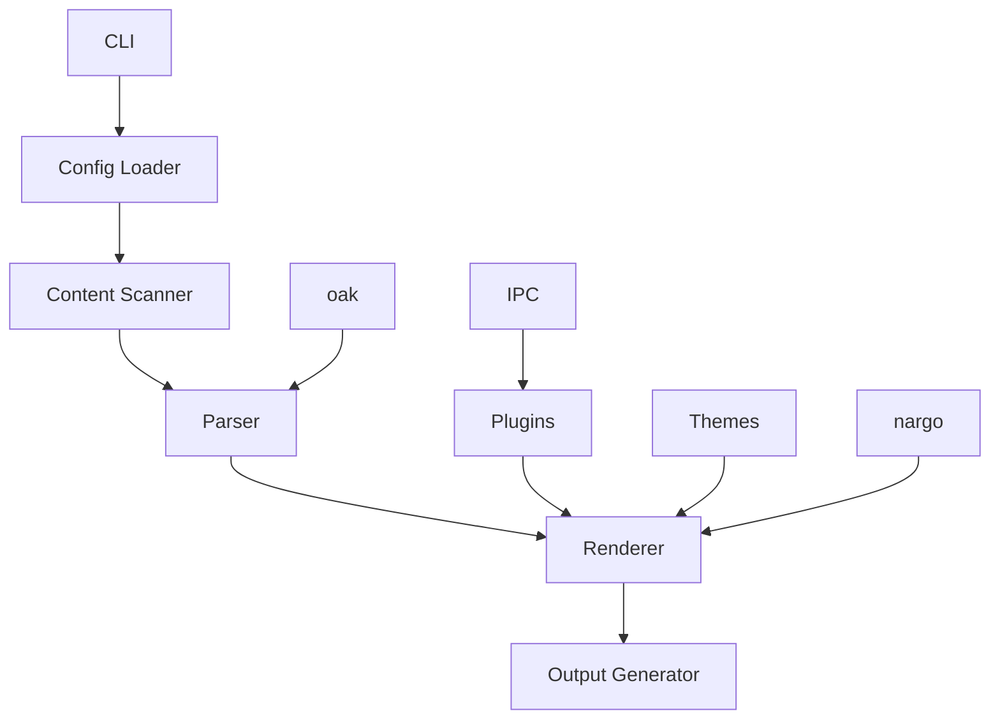

# Eleventy - Rust Reimplementation

## Overview

Eleventy (11ty) is a flexible, fast static site generator, now reimplemented in Rust for even better performance and reliability. It's designed to help you build modern websites with simplicity and flexibility, using your favorite template languages.

### 🎯 Key Features
- 🚀 **Fast Builds**: Compile your site in seconds, not minutes
- 🎨 **Template Flexibility**: Use multiple template languages in the same project
- 📦 **Easy Deployment**: Generate static files that work anywhere
- 🔧 **Extensible**: Customize with plugins and shortcodes
- 🛠 **Developer Friendly**: Great tooling and developer experience
- 📚 **Content-First**: Focus on your content, not the framework
- 🌍 **Cross-Platform**: Works on Windows, macOS, and Linux
- 📱 **100% Compatible**: Full compatibility when using static features

## Installation

### From Crates.io

```bash
cargo install eleventy
```

### From Source

```bash
# Clone the repository
git clone https://github.com/doki-land/rusty-ssg.git

# Build and install
cd rusty-ssg/compilers/eleventy
git checkout dev
cargo install --path .
```

## Usage

### Create a New Site

```bash
eleventy init my-site
cd my-site
```

### Develop Locally

```bash
eleventy --serve
```

This will start a local development server with hot reloading, so you can see your changes in real-time.

### Build for Production

```bash
eleventy build
```

This will generate optimized static files in the `_site` directory, ready for deployment.

## Architecture

Eleventy follows a modular architecture designed for performance and extensibility, leveraging external libraries for enhanced functionality:



### Core Components

- **CLI**: Command-line interface for interacting with the compiler
- **Config Loader**: Reads and parses Eleventy configuration files
- **Content Scanner**: Discovers and processes content files
- **Parser**: Converts source files to intermediate representation (uses oak)
- **Renderer**: Transforms intermediate representation to HTML
- **Output Generator**: Writes final static files
- **Plugins**: Extend functionality with custom plugins (uses IPC mode)
- **Themes**: Provide reusable templates and styles
- **nargo**: External library with analysis engines and bundlers
- **oak**: External library for parsing
- **IPC**: Inter-process communication for plugin system

## Configuration

Here's an example `.eleventy.js` file:

```javascript
// .eleventy.js
module.exports = function(eleventyConfig) {
  // Add passthrough copy for static assets
  eleventyConfig.addPassthroughCopy("src/images");
  eleventyConfig.addPassthroughCopy("src/css");
  
  // Add custom shortcodes
  eleventyConfig.addShortcode("year", () => new Date().getFullYear());
  
  // Add custom filters
  eleventyConfig.addFilter("uppercase", (str) => str.toUpperCase());
  
  // Set custom directories
  return {
    dir: {
      input: "src",
      output: "_site",
      includes: "_includes",
      data: "_data"
    },
    markdownTemplateEngine: "njk",
    htmlTemplateEngine: "njk",
    templateFormats: ["njk", "md", "html"]
  };
};
```

## Examples

### Example Template Include

Here's an example of a template include in Eleventy:

```njk
<!-- _includes/components/header.njk -->
<header>
  <h1>{{ metadata.title }}</h1>
  <nav>
    
      <a href="{{ item.url }}">{{ item.text }}</a>
    
  </nav>
</header>

<style>
  header {
    display: flex;
    justify-content: space-between;
    align-items: center;
    padding: 1rem;
    background-color: #f0f0f0;
  }
  
  h1 {
    margin: 0;
  }
  
  nav a {
    margin-left: 1rem;
    text-decoration: none;
    color: #333;
  }
</style>
```

### Example Blog Post

Here's an example of a blog post in Eleventy:

```markdown
---
title: "Getting Started with Eleventy"
date: 2024-01-01
author: "Your Name"
categories: ["tutorial", "getting-started"]
tags: ["eleventy", "static-site-generator"]
---

# Getting Started with Eleventy

Welcome to Eleventy! This is your first blog post.

## What is Eleventy?

Eleventy is a flexible, fast static site generator that lets you use your favorite template languages.

## Why Use Eleventy?

- It's flexible and customizable
- It supports multiple template languages
- It's fast and lightweight
- It has a great developer experience
- It's 100% compatible with static features

## Next Steps

1. Create more content
2. Customize your templates
3. Add plugins and shortcodes
4. Deploy your site

Happy coding! 🎉
```

## Compatibility Note

⚠️ **Important**: Eleventy provides 100% compatibility only when using static features. Dynamic features may have limited support or require additional configuration.

## Plugins

Eleventy supports a wide range of plugins to extend functionality (using IPC mode):

- 📊 **@11ty/eleventy-plugin-rss**: Generate RSS feeds
- 🎨 **@11ty/eleventy-plugin-syntaxhighlight**: Syntax highlighting for code blocks
- 🔧 **@11ty/eleventy-navigation**: Navigation helper
- 🖼️ **@11ty/eleventy-img**: Optimized image handling
- 📱 **@11ty/eleventy-plugin-pwa**: Progressive Web App support

## Templates

Eleventy supports multiple template languages out of the box:

- 📄 **Nunjucks** (njk): A powerful templating language with inheritance
- 📝 **Markdown** (md): For content files
- 🌐 **HTML** (html): Plain HTML files
- 🛍️ **Liquid**: Shopify's templating language
- 📋 **Handlebars**: A semantic templating language
- 🧩 **Mustache**: Logic-less templates
- 📜 **EJS**: Embedded JavaScript templates

## Deployment

Eleventy generates static files that can be deployed anywhere:

### Netlify

```toml
# netlify.toml
[build]
  command = "eleventy build"
  publish = "_site"
```

### Vercel

```json
// vercel.json
{
  "buildCommand": "eleventy build",
  "outputDirectory": "_site"
}
```

### GitHub Pages

```yaml
# .github/workflows/deploy.yml
name: Deploy
on: [push]
jobs:
  deploy:
    runs-on: ubuntu-latest
    steps:
      - uses: actions/checkout@v3
      - uses: actions-rs/toolchain@v1
        with:
          toolchain: stable
      - run: cargo install eleventy
      - run: eleventy build
      - uses: peaceiris/actions-gh-pages@v3
        with:
          github_token: ${{ secrets.GITHUB_TOKEN }}
          publish_dir: ./_site
```

## Contribution Guidelines

We welcome contributions to Eleventy! 🤝

### Reporting Issues

If you find a bug or have a feature request, please [open an issue](https://github.com/doki-land/rusty-ssg/issues).

### Pull Requests

1. Fork the repository
2. Create a new branch
3. Make your changes
4. Run tests
5. Submit a pull request

### Code Style

Please follow the Rust style guide and use `cargo fmt` to format your code.

## Acknowledgements

Eleventy is inspired by the original Eleventy project and benefits from the Rust ecosystem, including the nargo and oak libraries.

## License

Eleventy is licensed under the terms specified in the LICENSE file. See [LICENSE](https://github.com/doki-land/rusty-ssg/blob/dev/License.md) for more information.

---

Happy building with Eleventy! 🚀