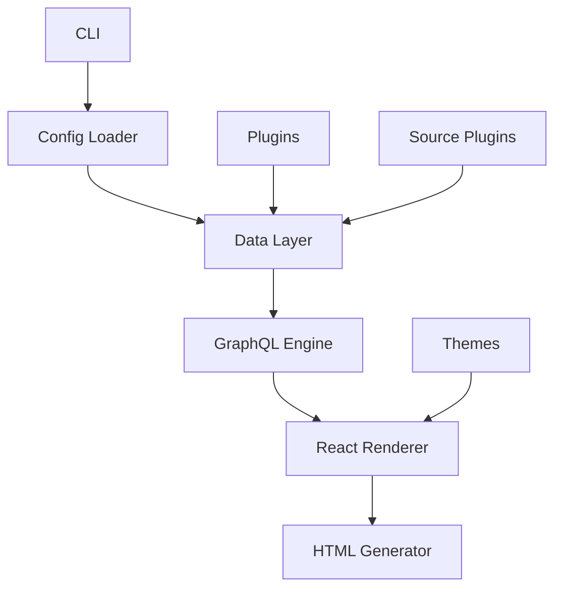

# Gatsby - Rust Implementation

## Overview

Gatsby is a powerful, fast static site generator, now implemented in Rust for even better performance and reliability. It's designed to help you build modern, feature-rich websites with React and GraphQL, combining the best of static site generation with dynamic capabilities.

### Key Features
- 🚀 **Fast Builds**: Compile your site in seconds, not minutes
- 🎨 **React-Based**: Use React for building components and pages
- 📦 **Easy Deployment**: Generate static files that work anywhere
- 🔧 **Extensible**: Customize with plugins and themes
- 🛠 **Developer Friendly**: Great tooling and developer experience
- 📊 **GraphQL Data Layer**: Query data from multiple sources

## Installation

### From Crates.io

```bash
cargo install gatsby
```

### From Source

```bash
# Clone the repository
git clone https://github.com/rusty-ssg/gatsby.git

# Build and install
cd gatsby
cargo install --path .
```

## Usage

### Create a New Site

```bash
gatsby new my-site
cd my-site
```

### Develop Locally

```bash
gatsby develop
```

This will start a local development server with hot reloading, so you can see your changes in real-time.

### Build for Production

```bash
gatsby build
```

This will generate optimized static files in the `public` directory, ready for deployment.

## Architecture

Gatsby follows a modular architecture designed for performance and extensibility:



### Core Components

- **CLI**: Command-line interface for interacting with the compiler
- **Config Loader**: Reads and parses Gatsby configuration files
- **Data Layer**: Collects and processes data from various sources
- **GraphQL Engine**: Provides a GraphQL API for querying data
- **React Renderer**: Renders React components to static HTML
- **HTML Generator**: Writes final static files
- **Plugins**: Extend functionality with custom plugins
- **Themes**: Provide reusable templates and styles
- **Source Plugins**: Fetch data from external sources

## Project Structure

Here's an example project structure for a Gatsby site:

```
my-site/
├── src/                # Source files
│   ├── components/      # React components
│   │   ├── Header.js
│   │   └── Footer.js
│   ├── pages/           # Page components
│   │   ├── index.js
│   │   ├── about.js
│   │   └── blog/         # Blog pages
│   │       ├── index.js
│   │       └── {slug}.js
│   ├── templates/       # Template components
│   │   └── blog-post.js
│   └── styles/          # CSS files
│       └── global.css
├── public/              # Generated output
├── static/              # Static assets
│   ├── images/
│   └── favicon.ico
├── gatsby-config.js     # Configuration file
├── gatsby-node.js       # Node API implementation
├── gatsby-browser.js    # Browser API implementation
└── package.json         # For npm dependencies
```

## Configuration

Here's an example `gatsby-config.js` file:

```javascript
// gatsby-config.js
module.exports = {
  siteMetadata: {
    title: "My Awesome Gatsby Site",
    description: "A description of my awesome Gatsby site",
    author: "Your Name",
    siteUrl: "https://example.com"
  },
  plugins: [
    "gatsby-plugin-react-helmet",
    "gatsby-plugin-sitemap",
    {
      resolve: "gatsby-source-filesystem",
      options: {
        name: "content",
        path: `${__dirname}/content`
      }
    },
    "gatsby-transformer-remark",
    {
      resolve: "gatsby-plugin-manifest",
      options: {
        name: "My Gatsby Site",
        short_name: "Gatsby Site",
        start_url: "/",
        background_color: "#ffffff",
        theme_color: "#4285f4",
        display: "standalone"
      }
    }
  ]
};
```

## Examples

### Example React Component

Here's an example of a React component in Gatsby:

```jsx
// src/components/Header.js
import React from "react";
import { Link } from "gatsby";

const Header = ({ siteTitle }) => (
  <header>
    <div>
      <h1>
        <Link to="/">{siteTitle}</Link>
      </h1>
      <nav>
        <Link to="/">Home</Link>
        <Link to="/about">About</Link>
        <Link to="/blog">Blog</Link>
      </nav>
    </div>
  </header>
);

export default Header;
```

### Example Blog Post Template

Here's an example of a blog post template in Gatsby:

```jsx
// src/templates/blog-post.js
import React from "react";
import { graphql } from "gatsby";

export const query = graphql`
  query($slug: String!) {
    markdownRemark(fields: { slug: { eq: $slug } }) {
      frontmatter {
        title
        date(formatString: "MMMM DD, YYYY")
        author
        categories
        tags
      }
      html
    }
  }
`;

const BlogPost = ({ data }) => {
  const post = data.markdownRemark;
  
  return (
    <div>
      <h1>{post.frontmatter.title}</h1>
      <p>{post.frontmatter.date} by {post.frontmatter.author}</p>
      <div dangerouslySetInnerHTML={{ __html: post.html }} />
    </div>
  );
};

export default BlogPost;
```

### Example Markdown Post

Here's an example of a markdown post in Gatsby:

```markdown
---
title: "Getting Started with Gatsby"
date: 2024-01-01
author: "Your Name"
categories: ["tutorial", "getting-started"]
tags: ["gatsby", "static-site-generator", "react"]
---

# Getting Started with Gatsby

Welcome to Gatsby! This is your first blog post.

## What is Gatsby?

Gatsby is a fast, modern static site generator that uses React and GraphQL to build powerful websites.

## Why Use Gatsby?

- It's blazingly fast
- It uses React for building components
- It has a powerful GraphQL data layer
- It has a rich ecosystem of plugins and themes

## Next Steps

1. Create more content
2. Add more plugins
3. Customize your theme
4. Deploy your site

Happy coding!
```

## Compatibility Note

⚠️ **Important**: Gatsby provides 100% compatibility only when using static features. Dynamic features may have limited support or require additional configuration.

## Plugins

Gatsby supports a wide range of plugins to extend functionality:

- **gatsby-source-filesystem**: Source data from the filesystem
- **gatsby-transformer-remark**: Transform Markdown to HTML
- **gatsby-plugin-react-helmet**: Manage document head
- **gatsby-plugin-sitemap**: Generate sitemap.xml
- **gatsby-plugin-manifest**: Generate PWA manifest
- **gatsby-plugin-sharp**: Image optimization
- **gatsby-transformer-sharp**: Transform images

## Themes

Choose from a variety of Gatsby themes or create your own:

- **gatsby-theme-blog**: Blog-focused theme
- **gatsby-theme-docs**: Documentation-focused theme
- **gatsby-theme-ecommerce**: E-commerce theme
- **gatsby-theme-portfolio**: Portfolio theme

## Deployment

Gatsby generates static files that can be deployed anywhere:

### Netlify

```toml
# netlify.toml
[build]
  command = "gatsby build"
  publish = "public"
```

### Vercel

```json
// vercel.json
{
  "buildCommand": "gatsby build",
  "outputDirectory": "public"
}
```

### GitHub Pages

```yaml
# .github/workflows/deploy.yml
name: Deploy
on: [push]
jobs:
  deploy:
    runs-on: ubuntu-latest
    steps:
      - uses: actions/checkout@v3
      - uses: actions-rs/toolchain@v1
        with:
          toolchain: stable
      - run: cargo install gatsby
      - run: gatsby build
      - uses: peaceiris/actions-gh-pages@v3
        with:
          github_token: ${{ secrets.GITHUB_TOKEN }}
          publish_dir: ./public
```

## Contribution Guidelines

We welcome contributions to Gatsby!

### Reporting Issues

If you find a bug or have a feature request, please [open an issue](https://github.com/rusty-ssg/gatsby/issues).

### Pull Requests

1. Fork the repository
2. Create a new branch
3. Make your changes
4. Run tests
5. Submit a pull request

### Code Style

Please follow the Rust style guide and use `cargo fmt` to format your code.

## License

Gatsby is licensed under the MIT License. See [LICENSE](LICENSE) for more information.

## Acknowledgements

Gatsby is inspired by the original Gatsby project and benefits from the Rust ecosystem.

---

Happy building with Gatsby! 🚀