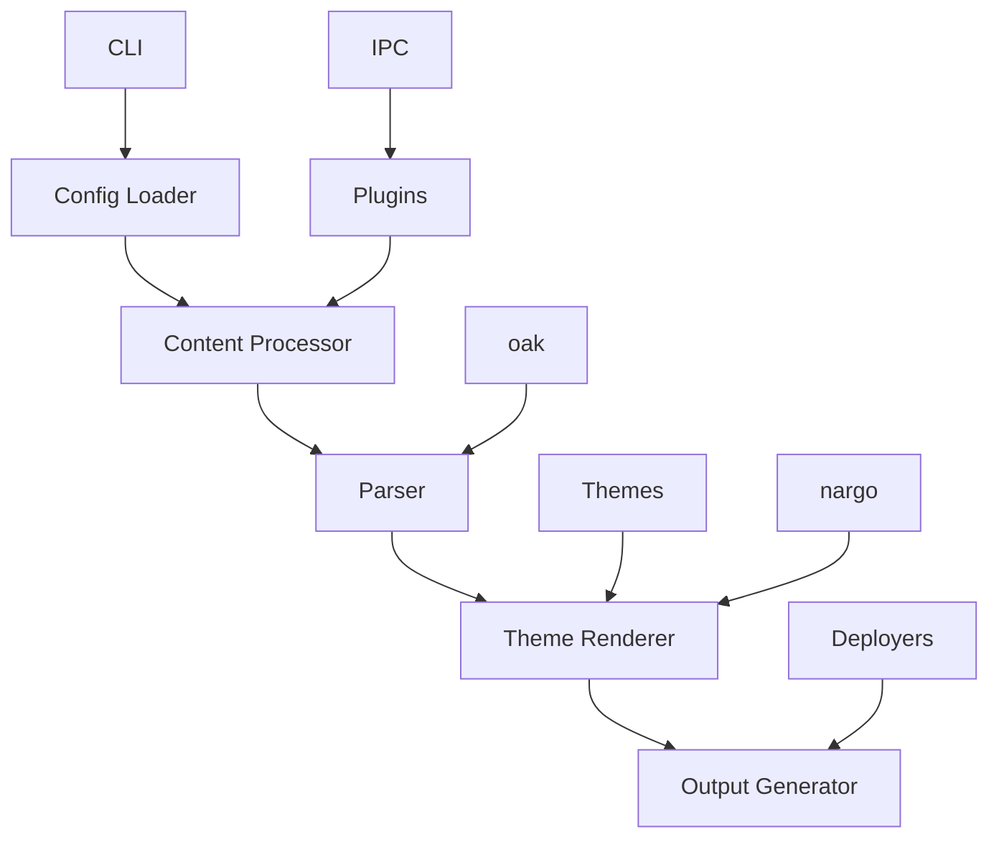

# Hexo - Rust Reimplementation

## Overview

Hexo is a fast, simple, and powerful static site generator, now reimplemented in Rust for even better performance and reliability. It's designed to help you build beautiful blogs and websites with ease, using Markdown and themes.

### 🎯 Key Features
- 🚀 **Fast Builds**: Compile your site in seconds, not minutes
- 🎨 **Theme System**: Choose from hundreds of themes or create your own
- 📦 **Easy Deployment**: Generate static files that work anywhere
- 🔧 **Extensible**: Customize with plugins and scripts
- 🛠 **Developer Friendly**: Great tooling and developer experience
- 📝 **Markdown Support**: Write content in Markdown with ease
- 🌍 **Cross-Platform**: Works on Windows, macOS, and Linux
- 📱 **100% Compatible**: Full compatibility when using static features

## Installation

### From Crates.io

```bash
cargo install hexo
```

### From Source

```bash
# Clone the repository
git clone https://github.com/doki-land/rusty-ssg.git

# Build and install
cd rusty-ssg/compilers/hexo
git checkout dev
cargo install --path .
```

## Usage

### Create a New Site

```bash
hexo init my-site
cd my-site
```

### Develop Locally

```bash
hexo server
```

This will start a local development server with hot reloading, so you can see your changes in real-time.

### Build for Production

```bash
hexo generate
```

This will generate optimized static files in the `public` directory, ready for deployment.

## Architecture

Hexo follows a modular architecture designed for performance and extensibility, leveraging external libraries for enhanced functionality:



### Core Components

- **CLI**: Command-line interface for interacting with the compiler
- **Config Loader**: Reads and parses Hexo configuration files
- **Content Processor**: Processes Markdown files and front matter
- **Parser**: Converts Markdown to HTML (uses oak)
- **Theme Renderer**: Renders content using theme templates
- **Output Generator**: Writes final static files
- **Plugins**: Extend functionality with custom plugins (uses IPC mode)
- **Themes**: Provide reusable templates and styles
- **Deployers**: Deploy static files to various platforms
- **nargo**: External library with analysis engines and bundlers
- **oak**: External library for parsing
- **IPC**: Inter-process communication for plugin system

## Configuration

Here's an example `_config.yml` file:

```yaml
# Site
title: My Awesome Hexo Site
subtitle: A subtitle for my site
description: A description of my awesome site
author: Your Name
language: en
timezone: UTC

# URL
url: https://example.com
root: /
permalink: :year/:month/:day/:title/
permalink_defaults:

# Directory
source_dir: source
theme_dir: themes
publish_dir: public

# Writing
new_post_name: :title.md # File name of new posts
default_layout: post
auto_spacing: true

# Extensions
theme: landscape
plugins:
  - hexo-generator-feed
  - hexo-generator-sitemap
  - hexo-renderer-marked
  - hexo-renderer-stylus

# Deployment
deploy:
  type: git
  repo: https://github.com/username/username.github.io.git
  branch: master
```

## Examples

### Example Blog Post

Here's an example of a blog post in Hexo:

```markdown
---
title: "Getting Started with Hexo"
date: 2024-01-01 10:00:00
tags: [hexo, static-site-generator, tutorial]
categories: [Tutorial, Getting Started]
author: Your Name
---

# Getting Started with Hexo

Welcome to Hexo! This is your first blog post.

## What is Hexo?

Hexo is a fast, simple, and powerful static site generator written in Rust.

## Why Use Hexo?

- It's blazingly fast
- It has a rich theme ecosystem
- It's easy to use
- It has great plugin support
- It's 100% compatible with static features

## Next Steps

1. Create more content
2. Customize your theme
3. Add plugins
4. Deploy your site

Happy coding! 🎉
```

### Example Page

Here's an example of a static page in Hexo:

```markdown
---
title: "About Me"
date: 2024-01-01 10:00:00
layout: page
---

# About Me

Hello! I'm using Hexo to build this site.

## My Background

I'm a web developer passionate about static site generators and modern web technologies.

## Contact

Feel free to reach out if you have any questions! 📧
```

## Compatibility Note

⚠️ **Important**: Hexo provides 100% compatibility only when using static features. Dynamic features may have limited support or require additional configuration.

## Plugins

Hexo supports a wide range of plugins to extend functionality (using IPC mode):

- 📊 **hexo-generator-feed**: Generate RSS/Atom feeds
- 🗺️ **hexo-generator-sitemap**: Generate sitemap.xml
- 📝 **hexo-renderer-marked**: Markdown renderer
- 🎨 **hexo-renderer-stylus**: Stylus CSS renderer
- 🚀 **hexo-deployer-git**: Git deployment
- 🖼️ **hexo-filter-responsive-images**: Responsive image support
- ☁️ **hexo-tag-cloud**: Tag cloud widget

## Themes

Choose from hundreds of Hexo themes or create your own:

- 🎨 **landscape**: Default theme, clean and modern
- 🌙 **next**: Elegant and powerful theme
- 🌵 **cactus**: Minimalist theme
- 🏛️ **icarus**: Material design theme
- 💧 **fluid**: Modern responsive theme

## Deployment

Hexo generates static files that can be deployed anywhere:

### Netlify

```toml
# netlify.toml
[build]
  command = "hexo generate"
  publish = "public"
```

### Vercel

```json
// vercel.json
{
  "buildCommand": "hexo generate",
  "outputDirectory": "public"
}
```

### GitHub Pages

```yaml
# .github/workflows/deploy.yml
name: Deploy
on: [push]
jobs:
  deploy:
    runs-on: ubuntu-latest
    steps:
      - uses: actions/checkout@v3
      - uses: actions-rs/toolchain@v1
        with:
          toolchain: stable
      - run: cargo install hexo
      - run: hexo generate
      - uses: peaceiris/actions-gh-pages@v3
        with:
          github_token: ${{ secrets.GITHUB_TOKEN }}
          publish_dir: ./public
```

## Contribution Guidelines

We welcome contributions to Hexo! 🤝

### Reporting Issues

If you find a bug or have a feature request, please [open an issue](https://github.com/doki-land/rusty-ssg/issues).

### Pull Requests

1. Fork the repository
2. Create a new branch
3. Make your changes
4. Run tests
5. Submit a pull request

### Code Style

Please follow the Rust style guide and use `cargo fmt` to format your code.

## Acknowledgements

Hexo is inspired by the original Hexo project and benefits from the Rust ecosystem, including the nargo and oak libraries.

## License

Hexo is licensed under the terms specified in the LICENSE file. See [LICENSE](https://github.com/doki-land/rusty-ssg/blob/dev/License.md) for more information.

---

Happy building with Hexo! 🚀