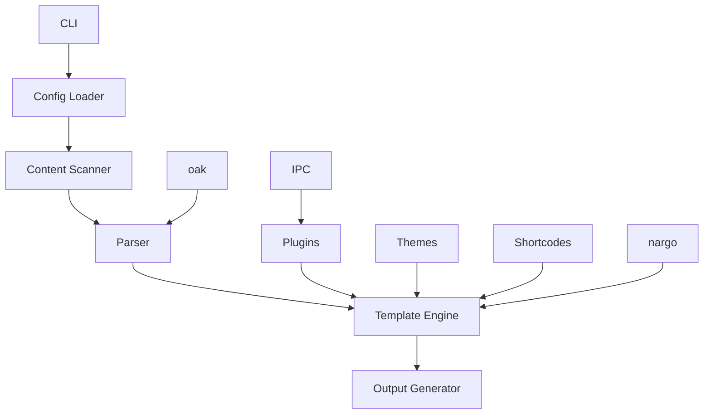

# Hugo - Rust Reimplementation

## Overview

Hugo is a blazingly fast static site generator, now reimplemented in Rust for even better performance and reliability. It's designed to help you build beautiful, modern websites with ease, combining speed with flexibility.

### 🎯 Key Features
- 🚀 **Fast Builds**: Compile your site in seconds, not minutes
- 🎨 **Powerful Templating**: Use Hugo's flexible template system
- 📦 **Easy Deployment**: Generate static files that work anywhere
- 🔧 **Extensible**: Customize with plugins and shortcodes
- 🛠 **Developer Friendly**: Great tooling and developer experience
- 📝 **Markdown Support**: Write content in Markdown with ease
- 🌍 **Cross-Platform**: Works on Windows, macOS, and Linux
- 📱 **100% Compatible**: Full compatibility when using static features

## Installation

### From Crates.io

```bash
cargo install hugo
```

### From Source

```bash
# Clone the repository
git clone https://github.com/doki-land/rusty-ssg.git

# Build and install
cd rusty-ssg/compilers/hugo
git checkout dev
cargo install --path .
```

## Usage

### Create a New Site

```bash
hugo init my-site
cd my-site
```

### Create a New Content File

```bash
hugo new content/posts/my-first-post.md
```

### Develop Locally

```bash
hugo server
```

This will start a local development server with hot reloading, so you can see your changes in real-time.

### Build for Production

```bash
hugo build
```

This will generate optimized static files in the `public` directory, ready for deployment.

## Architecture

Hugo follows a modular architecture designed for performance and extensibility, leveraging external libraries for enhanced functionality:



### Core Components

- **CLI**: Command-line interface for interacting with the compiler
- **Config Loader**: Reads and parses Hugo configuration files (TOML, YAML, or JSON)
- **Content Scanner**: Discovers and processes content files
- **Parser**: Converts Markdown to HTML (uses oak)
- **Template Engine**: Renders content using Hugo templates
- **Output Generator**: Writes final static files
- **Plugins**: Extend functionality with custom plugins (uses IPC mode)
- **Themes**: Provide reusable templates and styles
- **Shortcodes**: Reusable content components
- **nargo**: External library with analysis engines and bundlers
- **oak**: External library for parsing
- **IPC**: Inter-process communication for plugin system

## Configuration

Here's an example `config.toml` file:

```toml
[site]
title = "My Hugo Site"
description = "A site built with Rusty Hugo"
author = "Your Name"
base_url = "https://example.com"

[build]
output_dir = "public"

[params]
theme = "default"
disqus_shortname = "your-disqus-shortname"

[menu]
[[menu.main]]
name = "Home"
url = "/"
weight = 1

[[menu.main]]
name = "About"
url = "/about/"
weight = 2

[[menu.main]]
name = "Blog"
url = "/blog/"
weight = 3
```

## Examples

### Example Content File

Here's an example of a blog post in Hugo:

```markdown
---
title: "My First Post"
date: 2024-01-01
draft: false
tags:
  - rust
  - hugo
categories:
  - tutorials
---

# My First Post

This is the content of my first post.

## Using Shortcodes

Hugo shortcodes make it easy to add complex content:




fn main() {
    println!("Hello, Hugo!");
}


## Why Use Hugo?

- It's blazingly fast
- It has a powerful template system
- It supports shortcodes for reusable content
- It's 100% compatible with static features

Happy coding! 🎉
```

### Example Template

Here's an example of a Hugo template:

```html
<!-- layouts/_default/baseof.html -->
<!DOCTYPE html>
<html>
<head>
    <title>{{ .Site.Title }}</title>
    <link rel="stylesheet" href="{{ "css/style.css" | relURL }}">
</head>
<body>
    {{ partial "header.html" . }}
    <main>
        {{ block "main" . }}{{ end }}
    </main>
    {{ partial "footer.html" . }}
</body>
</html>
```

## Compatibility Note

⚠️ **Important**: Hugo provides 100% compatibility only when using static features. Dynamic features may have limited support or require additional configuration.

## Plugins

Hugo supports a wide range of plugins to extend functionality (using IPC mode):

- 📊 **katex**: Render mathematical formulas
- 🎨 **prism**: Syntax highlighting for code blocks
- 📈 **mermaid**: Render diagrams and flowcharts
- 🔍 **google-analytics**: Add Google Analytics tracking
- 🗺️ **sitemap**: Generate sitemap.xml

## Themes

Choose from a variety of Hugo themes or create your own:

- 🎨 **default**: Clean, modern design
- 🌙 **dark**: Dark mode theme
- 📦 **minimal**: Minimalist design
- 📝 **blog**: Blog-focused theme
- 📚 **docs**: Documentation-focused theme

## Deployment

Hugo generates static files that can be deployed anywhere:

### Netlify

```toml
# netlify.toml
[build]
  command = "hugo build"
  publish = "public"
```

### Vercel

```json
// vercel.json
{
  "buildCommand": "hugo build",
  "outputDirectory": "public"
}
```

### GitHub Pages

```yaml
# .github/workflows/deploy.yml
name: Deploy
on: [push]
jobs:
  deploy:
    runs-on: ubuntu-latest
    steps:
      - uses: actions/checkout@v3
      - uses: actions-rs/toolchain@v1
        with:
          toolchain: stable
      - run: cargo install hugo
      - run: hugo build
      - uses: peaceiris/actions-gh-pages@v3
        with:
          github_token: ${{ secrets.GITHUB_TOKEN }}
          publish_dir: ./public
```

## Contribution Guidelines

We welcome contributions to Hugo! 🤝

### Reporting Issues

If you find a bug or have a feature request, please [open an issue](https://github.com/rusty-ssg/hugo/issues).

### Pull Requests

1. Fork the repository
2. Create a new branch
3. Make your changes
4. Run tests
5. Submit a pull request

### Code Style

Please follow the Rust style guide and use `cargo fmt` to format your code.

## Acknowledgements

Hugo is inspired by the original Hugo project and benefits from the Rust ecosystem, including the nargo and oak libraries.

## License

Hugo is licensed under the terms specified in the LICENSE file. See [LICENSE](https://github.com/doki-land/rusty-ssg/blob/dev/License.md) for more information.

---

Happy building with Hugo! 🚀