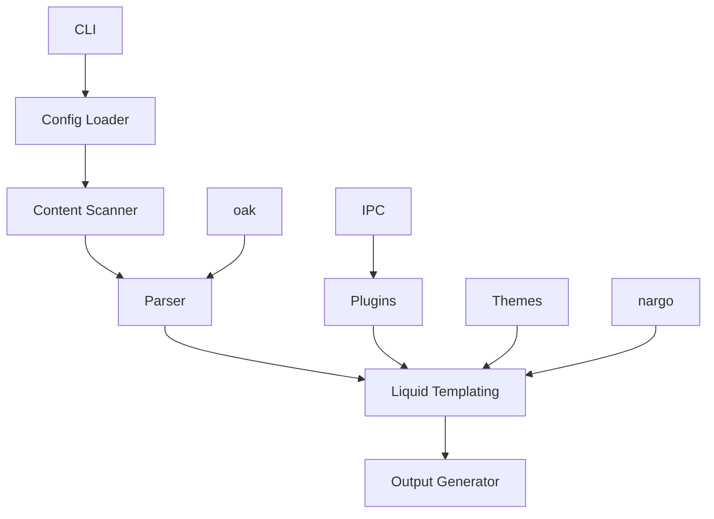

# Jekyll - Rust Reimplementation

## Overview

Jekyll is a simple, blog-aware static site generator, now reimplemented in Rust for even better performance and reliability. It's designed to help you build beautiful, content-focused websites with ease, using Markdown and Liquid templates.

### 🎯 Key Features
- 🚀 **Fast Builds**: Compile your site in seconds, not minutes
- 🎨 **Liquid Templating**: Use Jekyll's powerful Liquid template system
- 📦 **Easy Deployment**: Generate static files that work anywhere
- 🔧 **Extensible**: Customize with plugins and themes
- 🛠 **Developer Friendly**: Great tooling and developer experience
- 📝 **Markdown Support**: Write content in Markdown with ease
- 🌍 **Cross-Platform**: Works on Windows, macOS, and Linux
- 📱 **100% Compatible**: Full compatibility when using static features

## Installation

### From Crates.io

```bash
cargo install jekyll
```

### From Source

```bash
# Clone the repository
git clone https://github.com/doki-land/rusty-ssg.git

# Build and install
cd rusty-ssg/compilers/jekyll
git checkout dev
cargo install --path .
```

## Usage

### Create a New Site

```bash
jekyll init my-site
cd my-site
```

### Develop Locally

```bash
jekyll dev
```

This will start a local development server with hot reloading, so you can see your changes in real-time.

### Build for Production

```bash
jekyll build
```

This will generate optimized static files in the `_site` directory, ready for deployment.

## Architecture

Jekyll follows a modular architecture designed for performance and extensibility, leveraging external libraries for enhanced functionality:



### Core Components

- **CLI**: Command-line interface for interacting with the compiler
- **Config Loader**: Reads and parses Jekyll configuration files (YAML)
- **Content Scanner**: Discovers and processes content files
- **Parser**: Converts Markdown to HTML (uses oak)
- **Liquid Templating**: Renders content using Liquid templates
- **Output Generator**: Writes final static files
- **Plugins**: Extend functionality with custom plugins (uses IPC mode)
- **Themes**: Provide reusable templates and styles
- **nargo**: External library with analysis engines and bundlers
- **oak**: External library for parsing
- **IPC**: Inter-process communication for plugin system

## Configuration

Here's an example `_config.yml` file:

```yaml
# Site settings
title: My Jekyll Site
description: A site built with Rusty Jekyll
author: Your Name
email: your.email@example.com
baseurl: 
url: "https://example.com"

# Build settings
destination: _site
permalink: /:year/:month/:day/:title/
markdown: kramdown
highlighter: rouge

# Theme settings
theme: minima

# Plugins
plugins:
  - jekyll-feed
  - jekyll-sitemap
  - jekyll-seo-tag

# Exclude from processing.
exclude:
  - Gemfile
  - Gemfile.lock
  - node_modules
  - vendor/bundle/
  - vendor/cache/
  - vendor/gems/
  - vendor/ruby/
```

## Examples

### Example Blog Post

Here's an example of a blog post in Jekyll:

```markdown
---
layout: post
title: "Getting Started with Jekyll"
date: 2024-01-01 10:00:00 +0000
categories: tutorial getting-started
tags: jekyll static-site-generator
---

# Getting Started with Jekyll

Welcome to Jekyll! This is your first blog post.

## What is Jekyll?

Jekyll is a simple, blog-aware static site generator written in Rust.

## Why Use Jekyll?

- It's blazingly fast
- It uses Liquid templating for flexible layouts
- It's easy to use and configure
- It has a rich ecosystem of themes and plugins
- It's 100% compatible with static features

## Using Liquid Templates

Jekyll uses Liquid templates for flexible content rendering:


  <h1>{{ page.title }}</h1>



  <h2><a href="{{ post.url }}">{{ post.title }}</a></h2>
  <p>{{ post.excerpt }}</p>


## Next Steps

1. Create more content
2. Customize your theme
3. Add plugins
4. Deploy your site

Happy coding! 🎉
```

### Example Layout

Here's an example of a Jekyll layout:

```html
<!-- _layouts/default.html -->
<!DOCTYPE html>
<html>
<head>
    <title>{{ site.title }}</title>
    <link rel="stylesheet" href="{{ "/assets/main.css" | relative_url }}">
    
    
</head>
<body>
    
    <main>
        {{ content }}
    </main>
    
</body>
</html>
```

## Compatibility Note

⚠️ **Important**: Jekyll provides 100% compatibility only when using static features. Dynamic features may have limited support or require additional configuration.

## Plugins

Jekyll supports a wide range of plugins to extend functionality (using IPC mode):

- 📊 **jekyll-feed**: Generate RSS/Atom feeds
- 🗺️ **jekyll-sitemap**: Generate sitemap.xml
- 🔍 **jekyll-seo-tag**: Add SEO meta tags
- 🎨 **jekyll-paginate**: Add pagination to your blog
- 🖼️ **jekyll-responsive-image**: Responsive image support

## Themes

Choose from a variety of Jekyll themes or create your own:

- 🎨 **minima**: Default theme, clean and modern
- 🌙 **minimal-mistakes**: Versatile, responsive theme
- 📝 **jekyll-theme-blog**: Blog-focused theme
- 📚 **jekyll-theme-docs**: Documentation-focused theme
- 💼 **jekyll-theme-cayman**: Project page theme

## Deployment

Jekyll generates static files that can be deployed anywhere:

### Netlify

```toml
# netlify.toml
[build]
  command = "jekyll build"
  publish = "_site"
```

### Vercel

```json
// vercel.json
{
  "buildCommand": "jekyll build",
  "outputDirectory": "_site"
}
```

### GitHub Pages

```yaml
# .github/workflows/deploy.yml
name: Deploy
on: [push]
jobs:
  deploy:
    runs-on: ubuntu-latest
    steps:
      - uses: actions/checkout@v3
      - uses: actions-rs/toolchain@v1
        with:
          toolchain: stable
      - run: cargo install jekyll
      - run: jekyll build
      - uses: peaceiris/actions-gh-pages@v3
        with:
          github_token: ${{ secrets.GITHUB_TOKEN }}
          publish_dir: ./_site
```

## Contribution Guidelines

We welcome contributions to Jekyll! 🤝

### Reporting Issues

If you find a bug or have a feature request, please [open an issue](https://github.com/rusty-ssg/jekyll/issues).

### Pull Requests

1. Fork the repository
2. Create a new branch
3. Make your changes
4. Run tests
5. Submit a pull request

### Code Style

Please follow the Rust style guide and use `cargo fmt` to format your code.

## Acknowledgements

Jekyll is inspired by the original Jekyll project and benefits from the Rust ecosystem, including the nargo and oak libraries.

## License

Jekyll is licensed under the terms specified in the LICENSE file. See [LICENSE](https://github.com/doki-land/rusty-ssg/blob/dev/License.md) for more information.

---

Happy building with Jekyll! 🚀