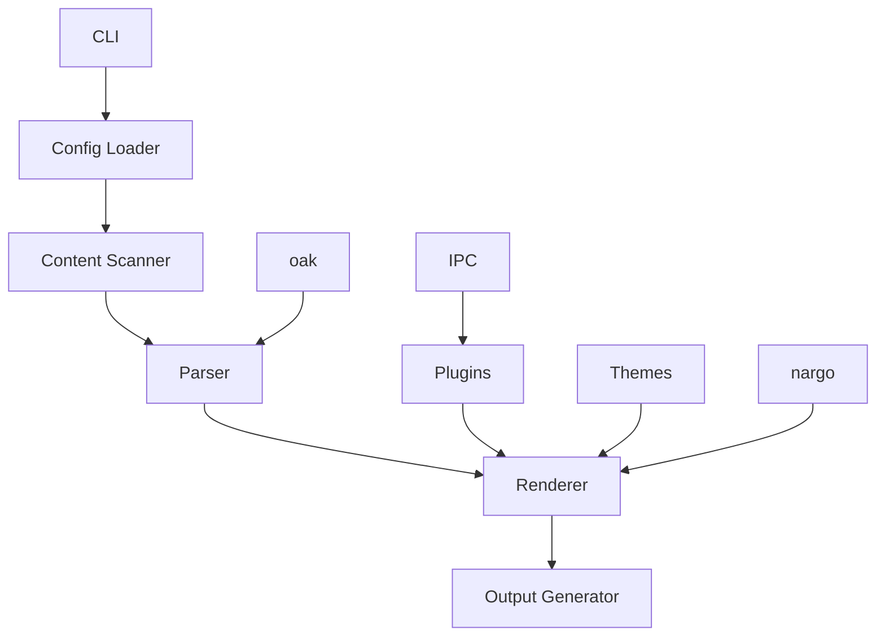

# MkDocs - Rust Reimplementation

## Overview

MkDocs is a fast, simple, and downright gorgeous static site generator for creating documentation, now reimplemented in Rust for even better performance and reliability. It's designed to help you build beautiful, documentation-focused websites with ease, using Markdown.

### 🎯 Key Features
- 🚀 **Fast Builds**: Compile your site in seconds, not minutes
- 🎨 **Beautiful Themes**: Use MkDocs's stunning themes
- 📦 **Easy Deployment**: Generate static files that work anywhere
- 🔧 **Extensible**: Customize with plugins and extensions
- 🛠 **Developer Friendly**: Great tooling and developer experience
- 📝 **Markdown Support**: Write content in Markdown with ease, including tables, footnotes, and code highlighting
- 🌍 **Cross-Platform**: Works on Windows, macOS, and Linux
- 📱 **100% Compatible**: Full compatibility when using static features
- 🔗 **Link Validation**: Ensure all internal links are valid
- 📁 **Directory URLs**: Support for clean, extensionless URLs
- 📋 **Strict Mode**: Validate configuration and content for correctness
- 🧩 **Configuration Inheritance**: Inherit settings from parent configurations

## Installation

### From Crates.io

```bash
cargo install mkdocs
```

### From Source

```bash
# Clone the repository
git clone https://github.com/doki-land/rusty-ssg.git

# Build and install
cd rusty-ssg/compilers/mkdocs
git checkout dev
cargo install --path .
```

## Usage

### Create a New Project

```bash
mkdocs new my-project
cd my-project
```

### Develop Locally

```bash
mkdocs serve
```

This will start a local development server with hot reloading, so you can see your changes in real-time.

### Build for Production

```bash
mkdocs build
```

This will generate optimized static files in the `site` directory, ready for deployment.

## Architecture

MkDocs follows a modular architecture designed for performance and extensibility, leveraging external libraries for enhanced functionality:



### Core Components

- **CLI**: Command-line interface for interacting with the compiler
- **Config Loader**: Reads and parses MkDocs configuration files (YAML)
- **Content Scanner**: Discovers and processes content files
- **Parser**: Converts Markdown to HTML (uses oak)
- **Renderer**: Renders content using theme templates
- **Output Generator**: Writes final static files
- **Plugins**: Extend functionality with custom plugins (uses IPC mode)
- **Themes**: Provide reusable templates and styles
- **nargo**: External library with analysis engines and bundlers
- **oak**: External library for parsing
- **IPC**: Inter-process communication for plugin system

## Configuration

Here's an example `mkdocs.yml` file:

```yaml
# Project information
site_name: My Docs
site_url: https://example.com
site_author: Your Name
site_description: A documentation site built with Rusty MkDocs

# Repository
repo_name: rusty-ssg/mkdocs
repo_url: https://github.com/rusty-ssg/mkdocs

# Configuration
nav:
  - Home: index.md
  - Getting Started: getting-started.md
  - Configuration: configuration.md
  - Plugins: plugins.md
  - Themes: themes.md

# Theme
theme:
  name: material
  features:
    - navigation.tabs
    - navigation.sections
    - toc.integrate
  palette:
    primary: indigo
    accent: teal

# Plugins
plugins:
  - search
  - mkdocstrings
  - minify:
      minify_html: true

# Markdown extensions
markdown_extensions:
  - toc:
      permalink: true
  - codehilite:
      linenums: true
  - admonition
  - pymdownx.details
  - pymdownx.superfences

# Advanced configuration
strict: true  # Enable strict mode for validation
docs_dir: docs  # Directory containing documentation files
site_dir: site  # Directory for generated site
use_directory_urls: true  # Use clean, extensionless URLs
```

## Examples

### Example Documentation Page

Here's an example of a documentation page in MkDocs:

```markdown
# Getting Started

Welcome to the MkDocs documentation!

## Installation

Install MkDocs using Cargo:

```bash
cargo install mkdocs
```

## Creating a New Project

Create a new MkDocs project:

```bash
mkdocs new my-project
cd my-project
```

## Project Structure

A typical MkDocs project structure looks like this:

```
my-project/
├── mkdocs.yml    # Configuration file
└── docs/
    ├── index.md  # Home page
    └── ...       # Other documentation pages
```

## Why Use MkDocs?

- It's blazingly fast
- It has beautiful themes out of the box
- It's easy to configure and use
- It's 100% compatible with static features

Happy documenting! 🎉
```

### Example Navigation Configuration

Here's an example of a more complex navigation configuration:

```yaml
nav:
  - Home: index.md
  - User Guide:
    - Getting Started: user-guide/getting-started.md
    - Installation: user-guide/installation.md
    - Usage: user-guide/usage.md
  - API Reference:
    - Overview: api-reference/overview.md
    - Endpoints: api-reference/endpoints.md
    - Models: api-reference/models.md
  - Contributing: contributing.md
  - Changelog: changelog.md
```

## Compatibility Note

⚠️ **Important**: MkDocs provides 100% compatibility only when using static features. Dynamic features may have limited support or require additional configuration.

## Plugins

MkDocs supports a wide range of plugins to extend functionality (using IPC mode):

- 🔍 **search**: Built-in search functionality
- 📚 **mkdocstrings**: Generate documentation from code
- 🎨 **minify**: Minify HTML and CSS
- 🗺️ **sitemap**: Generate sitemap.xml
- 📱 **responsive-images**: Responsive image support
- 💻 **prism**: Syntax highlighting for code blocks
- 📊 **katex**: Mathematical formula rendering
- 📈 **mermaid**: Diagram and flowchart rendering
- 📊 **google-analytics**: Google Analytics integration

## Themes

Choose from a variety of MkDocs themes or create your own:

- 🎨 **material**: Modern, responsive theme (default)
- 📦 **readthedocs**: ReadTheDocs-style theme
- 🌙 **mkdocs-bootstrap**: Bootstrap-based theme
- 📝 **mkdocs-cinder**: Clean, minimal theme
- 💼 **mkdocs-simple**: Simple, lightweight theme

## Deployment

MkDocs generates static files that can be deployed anywhere:

### Netlify

```toml
# netlify.toml
[build]
  command = "mkdocs build"
  publish = "site"
```

### Vercel

```json
// vercel.json
{
  "buildCommand": "mkdocs build",
  "outputDirectory": "site"
}
```

### GitHub Pages

```yaml
# .github/workflows/deploy.yml
name: Deploy
on: [push]
jobs:
  deploy:
    runs-on: ubuntu-latest
    steps:
      - uses: actions/checkout@v3
      - uses: actions-rs/toolchain@v1
        with:
          toolchain: stable
      - run: cargo install mkdocs
      - run: mkdocs build
      - uses: peaceiris/actions-gh-pages@v3
        with:
          github_token: ${{ secrets.GITHUB_TOKEN }}
          publish_dir: ./site
```

## Contribution Guidelines

We welcome contributions to MkDocs! 🤝

### Reporting Issues

If you find a bug or have a feature request, please [open an issue](https://github.com/rusty-ssg/mkdocs/issues).

### Pull Requests

1. Fork the repository
2. Create a new branch
3. Make your changes
4. Run tests
5. Submit a pull request

### Code Style

Please follow the Rust style guide and use `cargo fmt` to format your code.

## Acknowledgements

MkDocs is inspired by the original MkDocs project and benefits from the Rust ecosystem, including the nargo and oak libraries.

## License

MkDocs is licensed under the terms specified in the LICENSE file. See [LICENSE](https://github.com/doki-land/rusty-ssg/blob/dev/License.md) for more information.

---

Happy documenting with MkDocs! 🚀