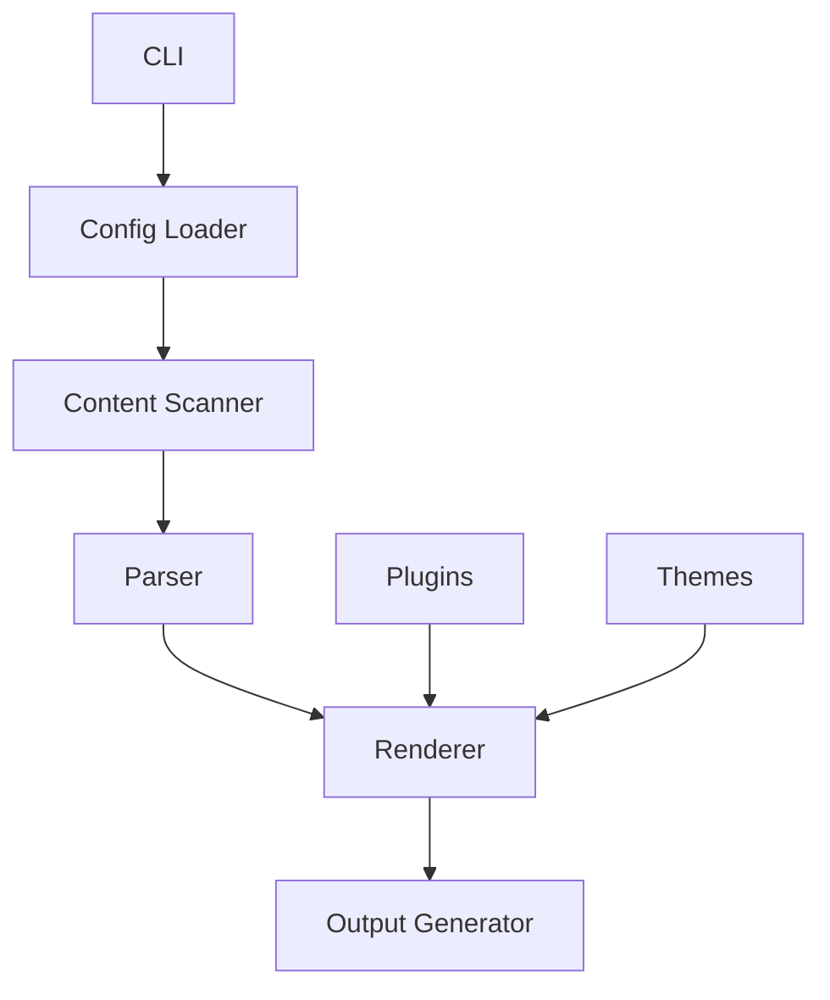

# {{Compiler Name}} - Rust Implementation

## Overview

{{Compiler Name}} is a blazingly fast static site generator, now implemented in Rust for even better performance and reliability. It's designed to help you build beautiful, modern websites with ease.

### Key Features
- 🚀 **Fast Builds**: Compile your site in seconds, not minutes
- 🎨 **Modern Templates**: Use the latest template syntax and features
- 📦 **Easy Deployment**: Generate static files that work anywhere
- 🔧 **Extensible**: Customize with plugins and themes
- 🛠 **Developer Friendly**: Great tooling and developer experience

## Installation

### From Crates.io

```bash
cargo install {{compiler-name}}
```

### From Source

```bash
# Clone the repository
git clone https://github.com/rusty-ssg/{{compiler-name}}.git

# Build and install
cd {{compiler-name}}
cargo install --path .
```

## Usage

### Create a New Site

```bash
{{compiler-name}} init my-site
cd my-site
```

### Develop Locally

```bash
{{compiler-name}} dev
```

This will start a local development server with hot reloading, so you can see your changes in real-time.

### Build for Production

```bash
{{compiler-name}} build
```

This will generate optimized static files in the `public` directory, ready for deployment.

## Architecture

{{Compiler Name}} follows a modular architecture designed for performance and extensibility:



### Core Components

- **CLI**: Command-line interface for interacting with the compiler
- **Config Loader**: Reads and parses configuration files
- **Content Scanner**: Discovers and processes content files
- **Parser**: Converts source files to intermediate representation
- **Renderer**: Transforms intermediate representation to HTML
- **Output Generator**: Writes final static files
- **Plugins**: Extend functionality with custom plugins
- **Themes**: Provide reusable templates and styles

## Project Structure

Here's an example project structure for a {{Compiler Name}} site:

```
my-site/
├── content/            # Markdown content files
│   ├── posts/          # Blog posts
│   │   ├── first-post.md
│   │   └── second-post.md
│   └── pages/          # Static pages
│       ├── about.md
│       └── contact.md
├── templates/          # Template files
│   ├── base.html
│   ├── post.html
│   └── page.html
├── static/             # Static assets
│   ├── css/
│   ├── js/
│   └── images/
├── {{compiler-name}}.config.toml  # Configuration file
└── package.json        # Optional: for npm dependencies
```

## Configuration

Here's an example `{{compiler-name}}.config.toml` file:

```toml
# Site settings
title = "My Awesome Site"
description = "A description of my awesome site"
author = "Your Name"

# Build settings
base_url = "https://example.com"
output_dir = "public"

# Theme settings
theme = "default"

# Plugin settings
[plugins]
enabled = ["katex", "prism"]

# Markdown settings
[markdown]
extensions = ["tables", "footnotes"]
```

## Examples

### Example Post

Here's an example of a blog post in {{Compiler Name}}:

```markdown
---
title: "Getting Started with {{Compiler Name}}"
date: 2024-01-01
author: "Your Name"
categories: ["tutorial", "getting-started"]
tags: ["{{compiler-name}}", "static-site-generator"]
---

# Getting Started with {{Compiler Name}}

Welcome to {{Compiler Name}}! This is your first post.

## What is {{Compiler Name}}?

{{Compiler Name}} is a fast, modern static site generator written in Rust.

## Why Use {{Compiler Name}}?

- It's blazingly fast
- It's easy to use
- It's highly customizable

## Next Steps

1. Create more content
2. Customize your templates
3. Deploy your site

Happy coding!
```

### Example Page

Here's an example of a static page in {{Compiler Name}}:

```markdown
---
title: "About Me"
date: 2024-01-01
---

# About Me

Hello! I'm using {{Compiler Name}} to build this site.

## My Background

I'm a web developer passionate about static site generators and modern web technologies.

## Contact

Feel free to reach out if you have any questions!
```

## Compatibility Note

⚠️ **Important**: {{Compiler Name}} provides 100% compatibility only when using static features. Dynamic features may have limited support or require additional configuration.

## Plugins

{{Compiler Name}} supports a wide range of plugins to extend functionality:

- **katex**: Render mathematical formulas
- **prism**: Syntax highlighting for code blocks
- **mermaid**: Render diagrams and flowcharts
- **google-analytics**: Add Google Analytics tracking
- **sitemap**: Generate sitemap.xml

## Themes

Choose from a variety of built-in themes or create your own:

- **default**: Clean, modern design
- **dark**: Dark mode theme
- **minimal**: Minimalist design
- **blog**: Blog-focused theme

## Deployment

{{Compiler Name}} generates static files that can be deployed anywhere:

### Netlify

```toml
# netlify.toml
[build]
  command = "{{compiler-name}} build"
  publish = "public"
```

### Vercel

```json
// vercel.json
{
  "buildCommand": "{{compiler-name}} build",
  "outputDirectory": "public"
}
```

### GitHub Pages

```yaml
# .github/workflows/deploy.yml
name: Deploy
on: [push]
jobs:
  deploy:
    runs-on: ubuntu-latest
    steps:
      - uses: actions/checkout@v3
      - uses: actions-rs/toolchain@v1
        with:
          toolchain: stable
      - run: cargo install {{compiler-name}}
      - run: {{compiler-name}} build
      - uses: peaceiris/actions-gh-pages@v3
        with:
          github_token: ${{ secrets.GITHUB_TOKEN }}
          publish_dir: ./public
```

## Contribution Guidelines

We welcome contributions to {{Compiler Name}}!

### Reporting Issues

If you find a bug or have a feature request, please [open an issue](https://github.com/rusty-ssg/{{compiler-name}}/issues).

### Pull Requests

1. Fork the repository
2. Create a new branch
3. Make your changes
4. Run tests
5. Submit a pull request

### Code Style

Please follow the Rust style guide and use `cargo fmt` to format your code.

## License

{{Compiler Name}} is licensed under the MIT License. See [LICENSE](LICENSE) for more information.

## Acknowledgements

{{Compiler Name}} is inspired by the original {{Compiler Name}} project and benefits from the Rust ecosystem.

---

Happy building with {{Compiler Name}}! 🚀