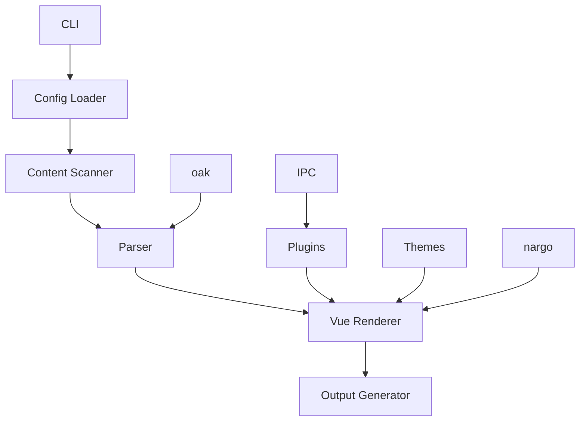

# VuePress - Rust Reimplementation

## Overview

VuePress is a fast, modern static site generator for documentation, now reimplemented in Rust for even better performance and reliability. It's designed to help you build beautiful, Vue-powered documentation sites with ease, using Markdown.

### 🎯 Key Features
- 🚀 **Fast Builds**: Compile your site in seconds, not minutes
- 🎨 **Vue-Powered**: Leverage Vue components in your documentation
- 📦 **Easy Deployment**: Generate static files that work anywhere
- 🔧 **Extensible**: Customize with plugins and themes
- 🛠 **Developer Friendly**: Great tooling and developer experience
- 📝 **Markdown Support**: Write content in Markdown with ease
- 🌍 **Cross-Platform**: Works on Windows, macOS, and Linux
- 📱 **100% Compatible**: Full compatibility when using static features

## Installation

### From Crates.io

```bash
cargo install vuepress
```

### From Source

```bash
# Clone the repository
git clone https://github.com/doki-land/rusty-ssg.git

# Build and install
cd rusty-ssg/compilers/vuepress
git checkout dev
cargo install --path .
```

## Usage

### Initialize a New Site

```bash
vuepress init my-docs
cd my-docs
```

### Develop Locally

```bash
vuepress dev
```

This will start a local development server with hot reloading, so you can see your changes in real-time.

### Build for Production

```bash
vuepress build
```

This will generate optimized static files in the `.vuepress/dist` directory, ready for deployment.

## Architecture

VuePress follows a modular architecture designed for performance and extensibility, leveraging external libraries for enhanced functionality:



### Core Components

- **CLI**: Command-line interface for interacting with the compiler
- **Config Loader**: Reads and parses VuePress configuration files (TOML/JavaScript)
- **Content Scanner**: Discovers and processes content files
- **Parser**: Converts Markdown to HTML (uses oak)
- **Vue Renderer**: Renders content using Vue components
- **Output Generator**: Writes final static files
- **Plugins**: Extend functionality with custom plugins (uses IPC mode)
- **Themes**: Provide reusable templates and styles
- **nargo**: External library with analysis engines and bundlers
- **oak**: External library for parsing
- **IPC**: Inter-process communication for plugin system

## Configuration

Here's an example `vuepress.config.toml` file:

```toml
[site]
title = "My Documentation"
description = "A comprehensive guide to my project"

[theme]
logo = "/assets/logo.png"

[nav]
[[nav.item]]
text = "Home"
link = "/"

[[nav.item]]
text = "Guide"
link = "/guide/"

[sidebar]
[[sidebar.item]]
text = "Getting Started"
link = "/guide/getting-started/"

[[sidebar.item]]
text = "Advanced Topics"
link = "/guide/advanced/"
```

## Examples

### Example Documentation Page

Here's an example of a documentation page in VuePress:

```markdown
---
title: Getting Started
description: Learn how to get started with our project
---

# Getting Started

Welcome to our project! This guide will help you get started quickly.

## Installation

To install our project, run:

```bash
npm install
```

## Usage

Once installed, you can use it as follows:

```javascript
const myProject = require('my-project');
myProject.initialize();
```

## Vue Components in Markdown

VuePress allows you to use Vue components directly in your Markdown files:

```vue
<template>
  <div class="welcome">
    <h2>Welcome to VuePress!</h2>
    <p>This is a Vue component embedded in Markdown.</p>
  </div>
</template>

<style scoped>
.welcome {
  padding: 2rem;
  background-color: #f0f0f0;
  border-radius: 8px;
}
</style>
```

## Why Use VuePress?

- It's blazingly fast
- It uses Vue for powerful component-based documentation
- It has a clean, modern default theme
- It's 100% compatible with static features

Happy documenting! 🎉
```

### Example Directory Structure

Here's an example of a VuePress project structure:

```
my-docs/
├── .vuepress/
│   ├── config.toml    # Configuration file
│   ├── dist/           # Generated output
│   └── public/         # Static assets
├── guide/
│   ├── getting-started.md
│   └── advanced.md
└── README.md           # Home page
```

## Compatibility Note

⚠️ **Important**: VuePress provides 100% compatibility only when using static features. Dynamic features may have limited support or require additional configuration.

## Plugins

VuePress supports a wide range of plugins to extend functionality (using IPC mode):

- 🔍 **search**: Built-in search functionality
- 📊 **katex**: Render mathematical formulas
- 🎨 **prism**: Syntax highlighting for code blocks
- 📈 **mermaid**: Render diagrams and flowcharts
- 🗺️ **sitemap**: Generate sitemap.xml

## Themes

VuePress comes with a beautiful default theme that's highly customizable. You can also create your own themes:

- 🎨 **default**: Modern, responsive theme (default)
- 🌙 **dark**: Dark mode theme
- 📦 **minimal**: Minimalist design
- 📝 **docs**: Documentation-focused theme

## Deployment

VuePress generates static files that can be deployed anywhere:

### Netlify

```toml
# netlify.toml
[build]
  command = "vuepress build"
  publish = ".vuepress/dist"
```

### Vercel

```json
// vercel.json
{
  "buildCommand": "vuepress build",
  "outputDirectory": ".vuepress/dist"
}
```

### GitHub Pages

```yaml
# .github/workflows/deploy.yml
name: Deploy
on: [push]
jobs:
  deploy:
    runs-on: ubuntu-latest
    steps:
      - uses: actions/checkout@v3
      - uses: actions-rs/toolchain@v1
        with:
          toolchain: stable
      - run: cargo install vuepress
      - run: vuepress build
      - uses: peaceiris/actions-gh-pages@v3
        with:
          github_token: ${{ secrets.GITHUB_TOKEN }}
          publish_dir: ./.vuepress/dist
```

## Contribution Guidelines

We welcome contributions to VuePress! 🤝

### Reporting Issues

If you find a bug or have a feature request, please [open an issue](https://github.com/rusty-ssg/vuepress/issues).

### Pull Requests

1. Fork the repository
2. Create a new branch
3. Make your changes
4. Run tests
5. Submit a pull request

### Code Style

Please follow the Rust style guide and use `cargo fmt` to format your code.

## Acknowledgements

VuePress is inspired by the original VuePress project and benefits from the Rust ecosystem, including the nargo and oak libraries.

## License

VuePress is licensed under the terms specified in the LICENSE file. See [LICENSE](https://github.com/doki-land/rusty-ssg/blob/dev/License.md) for more information.

---

Happy documenting with VuePress! 🚀