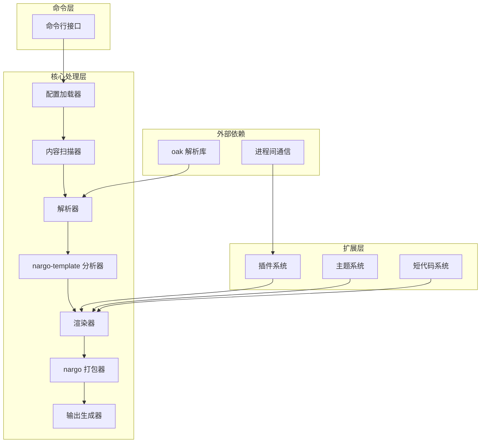

# Rusty SSG 架构设计

## 整体架构

Rusty SSG 采用模块化、可扩展的架构设计，旨在提供高性能的静态站点生成能力。所有编译器都遵循统一的架构模式，同时保留各自的特性。

### 架构图

## 核心组件详解

### 1. 命令行接口 (CLI)

**功能**：提供用户与编译器交互的命令行界面，处理命令解析和执行。

**职责**：
- 解析命令行参数
- 调用相应的核心功能
- 处理用户输入和输出
- 提供帮助信息和版本信息

**实现**：每个编译器都有自己的 CLI 实现，位于 `bin/` 目录下。

### 2. 配置加载器 (Config Loader)

**功能**：读取和解析项目配置文件，为编译器提供配置信息。

**职责**：
- 加载配置文件（支持 TOML、YAML、JSON 等格式）
- 解析配置内容
- 提供配置访问接口
- 处理配置默认值

**实现**：位于每个编译器的 `src/config/` 目录。

### 3. 内容扫描器 (Content Scanner)

**功能**：发现和处理项目中的内容文件。

**职责**：
- 遍历项目目录结构
- 识别内容文件（Markdown、HTML 等）
- 收集文件元数据
- 构建内容树结构

**实现**：位于每个编译器的核心处理逻辑中。

### 4. 解析器 (Parser)

**功能**：将源文件转换为中间表示形式。

**职责**：
- 使用 oak 库解析 Markdown、HTML 等文件
- 处理 front matter
- 生成抽象语法树 (AST)
- 支持语法高亮和特殊语法

**实现**：位于每个编译器的 `src/compiler/parser/` 目录，使用 oak 库进行解析。

### 5. 模板分析器 (nargo-template Analyzer)

**功能**：分析模板文件和内容，为渲染做准备。

**职责**：
- 分析模板语法
- 解析模板变量和表达式
- 构建模板依赖关系
- 优化模板执行

**实现**：使用 nargo-template 库进行模板分析。

### 6. 渲染器 (Renderer)

**功能**：将中间表示转换为最终的 HTML 输出。

**职责**：
- 执行模板渲染
- 应用主题和样式
- 处理插件扩展
- 生成静态 HTML 内容

**实现**：位于每个编译器的 `src/compiler/renderer/` 目录。

### 7. 打包器 (nargo Bundler)

**功能**：打包和优化输出文件。

**职责**：
- 合并和压缩 CSS/JS 文件
- 优化静态资源
- 处理资源依赖
- 生成最终的静态文件

**实现**：使用 nargo 库进行打包和优化。

### 8. 输出生成器 (Output Generator)

**功能**：将渲染和打包后的内容写入文件系统。

**职责**：
- 创建输出目录结构
- 写入静态文件
- 处理文件权限
- 生成站点地图和其他元数据文件

**实现**：位于每个编译器的核心处理逻辑中。

### 9. 插件系统 (Plugins)

**功能**：扩展编译器功能。

**职责**：
- 提供插件 API
- 管理插件生命周期
- 处理插件钩子
- 支持第三方插件

**实现**：位于每个编译器的 `src/plugin/` 目录，使用 IPC 模式与插件通信。

### 10. 主题系统 (Themes)

**功能**：提供可重用的模板和样式。

**职责**：
- 加载和应用主题
- 处理主题继承
- 提供主题配置选项
- 支持自定义主题

**实现**：位于每个编译器的主题相关目录。

### 11. 短代码系统 (Shortcodes)

**功能**：提供可重用的内容组件（特定于某些编译器如 Hugo）。

**职责**：
- 解析和执行短代码
- 提供内置短代码
- 支持自定义短代码

**实现**：位于支持短代码的编译器中，如 Hugo 的 `src/compiler/shortcodes/` 目录。

## 技术依赖

### 核心依赖

- **Rust**：主要开发语言，提供高性能和内存安全
- **oak**：内部开发的解析库，用于解析各种文件格式
- **nargo**：内部开发的工具库，提供模板分析和打包功能
- **Cargo**：Rust 包管理器和构建工具

### 辅助依赖

- **pnpm**：用于管理 JavaScript 依赖
- **TOML/YAML/JSON 解析库**：用于解析配置文件
- **HTTP 服务器**：用于开发模式
- **文件系统监控**：用于热重载功能

## 编译流程

1. **配置解析**：读取和解析项目配置文件
2. **内容扫描**：遍历项目目录，收集所有需要处理的文件
3. **语法解析**：使用 oak 解析器解析模板和内容文件
4. **模板分析**：使用 nargo-template 分析模板和内容
5. **数据处理**：处理和准备模板所需的数据
6. **模板渲染**：将数据应用到模板中
7. **资源打包**：使用 nargo 打包和优化资源
8. **输出生成**：生成最终的静态文件

## 性能优化

### 并行处理

Rusty SSG 使用 Rust 的并行处理能力，同时处理多个文件，提高构建速度。

### 缓存机制

实现了高效的缓存系统，只重新处理修改过的文件，减少不必要的计算。

### 内存管理

利用 Rust 的内存安全特性，优化内存使用，减少内存分配和释放开销。

### 增量构建

支持增量构建，只处理修改过的文件和依赖，进一步提高构建速度。

## 扩展性设计

### 插件 API

提供统一的插件 API，允许开发者扩展编译器功能。

### 主题系统

支持主题继承和自定义，方便用户快速构建具有一致风格的站点。

### 配置系统

灵活的配置系统，允许用户根据需要自定义编译器行为。

### 模板引擎

支持多种模板引擎，适应不同用户的需求。

## 跨平台支持

Rusty SSG 设计为跨平台兼容，支持：

- Windows
- macOS
- Linux

使用 Rust 的跨平台特性，确保在不同操作系统上的一致体验。

## 安全性考虑

### 输入验证

对所有用户输入进行严格验证，防止注入攻击。

### 资源限制

实现资源使用限制，防止恶意输入导致的资源耗尽。

### 沙箱执行

插件在隔离的环境中执行，防止恶意插件访问系统资源。

## 未来发展

### 计划的功能

- 更多编译器的支持
- 更丰富的插件生态系统
- 更好的开发工具集成
- 更高级的优化技术

### 架构演进

Rusty SSG 的架构设计为可演进的，允许随着技术发展和用户需求变化而调整。

---

通过这种模块化、可扩展的架构设计，Rusty SSG 能够提供高性能、灵活的静态站点生成能力，同时保持与原始静态站点生成器的兼容性。