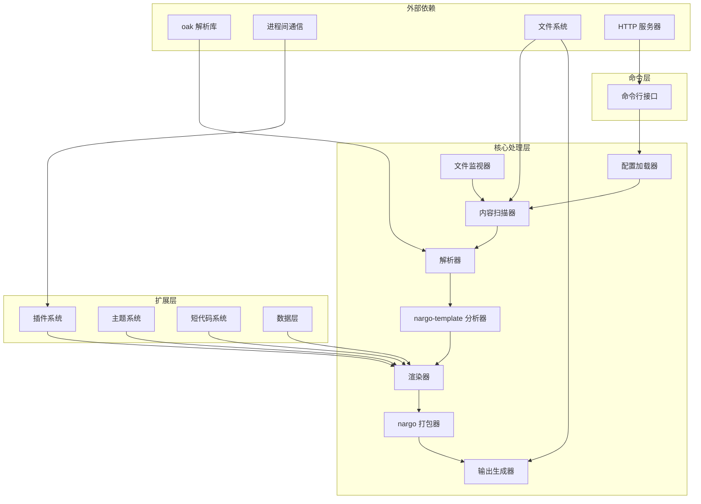

# Rusty SSG 架构设计

## 整体架构

Rusty SSG 采用模块化、可扩展的架构设计，旨在提供高性能的静态站点生成能力。所有编译器都遵循统一的架构模式，同时保留各自的特性。

### 架构图

## 核心组件详解

### 1. 命令行接口 (CLI)

**功能**：提供用户与编译器交互的命令行界面，处理命令解析和执行。

**职责**：
- 解析命令行参数
- 调用相应的核心功能
- 处理用户输入和输出
- 提供帮助信息和版本信息
- 启动开发服务器

**实现**：每个编译器都有自己的 CLI 实现，位于 `bin/` 目录下，如 `bin/astro.rs`、`bin/hugo.rs` 等。

### 2. 配置加载器 (Config Loader)

**功能**：读取和解析项目配置文件，为编译器提供配置信息。

**职责**：
- 加载配置文件（支持 TOML、YAML、JSON 等格式）
- 解析配置内容
- 提供配置访问接口
- 处理配置默认值
- 验证配置有效性

**实现**：位于每个编译器的 `src/config/` 目录，如 `src/config/mod.rs`。

### 3. 内容扫描器 (Content Scanner)

**功能**：发现和处理项目中的内容文件。

**职责**：
- 遍历项目目录结构
- 识别内容文件（Markdown、HTML 等）
- 收集文件元数据
- 构建内容树结构
- 检测文件变更（用于增量构建）

**实现**：位于每个编译器的核心处理逻辑中，与文件系统交互。

### 4. 解析器 (Parser)

**功能**：将源文件转换为中间表示形式。

**职责**：
- 使用 oak 库解析 Markdown、HTML 等文件
- 处理 front matter
- 生成抽象语法树 (AST)
- 支持语法高亮和特殊语法
- 处理模板语法

**实现**：位于每个编译器的 `src/compiler/parser/` 目录，使用 oak 库进行解析，如 `src/compiler/parser/mod.rs`。

### 5. 模板分析器 (nargo-template Analyzer)

**功能**：分析模板文件和内容，为渲染做准备。

**职责**：
- 分析模板语法
- 解析模板变量和表达式
- 构建模板依赖关系
- 优化模板执行
- 处理模板继承

**实现**：使用 nargo-template 库进行模板分析，集成在编译器的核心处理流程中。

### 6. 渲染器 (Renderer)

**功能**：将中间表示转换为最终的 HTML 输出。

**职责**：
- 执行模板渲染
- 应用主题和样式
- 处理插件扩展
- 生成静态 HTML 内容
- 处理组件（如 Astro、React、Vue 等）

**实现**：位于每个编译器的 `src/compiler/renderer/` 目录，如 `src/compiler/renderer/html_renderer.rs`。

### 7. 打包器 (nargo Bundler)

**功能**：打包和优化输出文件。

**职责**：
- 合并和压缩 CSS/JS 文件
- 优化静态资源
- 处理资源依赖
- 生成最终的静态文件
- 优化资源加载顺序

**实现**：使用 nargo 库进行打包和优化，集成在编译器的输出流程中。

### 8. 输出生成器 (Output Generator)

**功能**：将渲染和打包后的内容写入文件系统。

**职责**：
- 创建输出目录结构
- 写入静态文件
- 处理文件权限
- 生成站点地图和其他元数据文件
- 清理旧的输出文件

**实现**：位于每个编译器的核心处理逻辑中，如 `src/tools/site_generator.rs`。

### 9. 文件监视器 (Watcher)

**功能**：监控文件系统变化，支持热重载。

**职责**：
- 监控项目文件变化
- 触发增量构建
- 支持开发模式下的热重载
- 提高开发效率

**实现**：位于每个编译器的 `src/watcher/` 目录，如 `src/watcher/mod.rs`。

### 10. 插件系统 (Plugins)

**功能**：扩展编译器功能。

**职责**：
- 提供插件 API
- 管理插件生命周期
- 处理插件钩子
- 支持第三方插件
- 提供插件加载和卸载机制

**实现**：位于每个编译器的 `src/plugin/` 目录，使用 IPC 模式与插件通信，如 `src/plugin/manager.rs`。

### 11. 主题系统 (Themes)

**功能**：提供可重用的模板和样式。

**职责**：
- 加载和应用主题
- 处理主题继承
- 提供主题配置选项
- 支持自定义主题
- 管理主题资源

**实现**：位于每个编译器的主题相关目录，如 `src/tools/theme/`。

### 12. 短代码系统 (Shortcodes)

**功能**：提供可重用的内容组件（特定于某些编译器如 Hugo）。

**职责**：
- 解析和执行短代码
- 提供内置短代码
- 支持自定义短代码
- 处理短代码参数

**实现**：位于支持短代码的编译器中，如 Hugo 的 `src/compiler/shortcodes/` 目录。

### 13. 数据层 (Data Layer)

**功能**：提供数据处理和管理能力。

**职责**：
- 加载和处理数据文件
- 提供数据访问接口
- 支持数据转换和处理
- 集成外部数据源

**实现**：位于每个编译器的 `src/data/` 目录，如 `src/data/mod.rs`。

## 技术依赖

### 核心依赖

- **Rust**：主要开发语言，提供高性能和内存安全
- **oak**：内部开发的解析库，用于解析各种文件格式
- **nargo**：内部开发的工具库，提供模板分析和打包功能
- **Cargo**：Rust 包管理器和构建工具

### 辅助依赖

- **pnpm**：用于管理 JavaScript 依赖
- **TOML/YAML/JSON 解析库**：用于解析配置文件
- **HTTP 服务器**：用于开发模式
- **文件系统监控**：用于热重载功能
- **正则表达式库**：用于文本处理
- **并发库**：用于并行处理

## 编译流程

1. **配置解析**：读取和解析项目配置文件，应用默认值和验证
2. **内容扫描**：遍历项目目录，收集所有需要处理的文件，构建内容树
3. **依赖分析**：分析文件之间的依赖关系，构建依赖图
4. **语法解析**：使用 oak 解析器解析模板和内容文件，生成 AST
5. **模板分析**：使用 nargo-template 分析模板和内容，优化模板执行
6. **数据处理**：加载和处理数据文件，准备模板所需的数据
7. **模板渲染**：将数据应用到模板中，生成 HTML 内容
8. **资源处理**：处理和优化静态资源，如 CSS、JS、图片等
9. **资源打包**：使用 nargo 打包和优化资源，减少文件大小
10. **输出生成**：生成最终的静态文件，包括 HTML、CSS、JS、图片等
11. **站点地图生成**：生成站点地图和其他元数据文件

## 性能优化

### 并行处理

Rusty SSG 使用 Rust 的并行处理能力，同时处理多个文件，提高构建速度：
- 使用 `rayon` 库实现并行处理
- 对独立文件进行并行处理
- 利用多核 CPU 资源

### 缓存机制

实现了高效的缓存系统，只重新处理修改过的文件，减少不必要的计算：
- 基于文件哈希的缓存系统
- 缓存中间结果
- 智能检测文件变更

### 内存管理

利用 Rust 的内存安全特性，优化内存使用，减少内存分配和释放开销：
- 使用栈分配而非堆分配
- 避免不必要的内存复制
- 合理使用引用和借用

### 增量构建

支持增量构建，只处理修改过的文件和依赖，进一步提高构建速度：
- 跟踪文件修改时间
- 构建依赖图，只重建受影响的文件
- 缓存构建结果

### I/O 优化

优化文件系统 I/O 操作，减少磁盘访问：
- 批量读取和写入文件
- 减少文件系统操作次数
- 使用内存映射技术处理大文件

## 扩展性设计

### 插件 API

提供统一的插件 API，允许开发者扩展编译器功能：
- 基于 IPC 的插件通信机制
- 丰富的插件钩子
- 插件生命周期管理
- 插件配置系统

### 主题系统

支持主题继承和自定义，方便用户快速构建具有一致风格的站点：
- 主题继承机制
- 主题配置选项
- 主题资源管理
- 主题模板系统

### 配置系统

灵活的配置系统，允许用户根据需要自定义编译器行为：
- 支持多种配置格式（TOML、YAML、JSON）
- 配置层次结构
- 配置验证和默认值
- 环境变量支持

### 模板引擎

支持多种模板引擎，适应不同用户的需求：
- 内置模板引擎支持
- 模板继承和包含
- 模板函数和过滤器
- 自定义模板标签

## 跨平台支持

Rusty SSG 设计为跨平台兼容，支持：

- Windows
- macOS
- Linux

使用 Rust 的跨平台特性，确保在不同操作系统上的一致体验：
- 统一的文件路径处理
- 跨平台的文件系统操作
- 平台特定的优化

## 安全性考虑

### 输入验证

对所有用户输入进行严格验证，防止注入攻击：
- 模板变量转义
- 输入数据验证
- 防止 XSS 攻击

### 资源限制

实现资源使用限制，防止恶意输入导致的资源耗尽：
- 内存使用限制
- 执行时间限制
- 文件大小限制

### 沙箱执行

插件在隔离的环境中执行，防止恶意插件访问系统资源：
- 基于 IPC 的插件隔离
- 限制插件权限
- 插件资源使用监控

### 依赖安全

确保所有依赖的安全性：
- 定期更新依赖
- 依赖安全扫描
- 最小化依赖树

## 未来发展

### 计划的功能

- 更多编译器的支持
- 更丰富的插件生态系统
- 更好的开发工具集成
- 更高级的优化技术
- 云服务集成
- 国际化支持

### 架构演进

Rusty SSG 的架构设计为可演进的，允许随着技术发展和用户需求变化而调整：
- 模块化设计便于扩展
- 抽象层允许替换实现
- 插件系统支持功能扩展
- 配置系统支持行为定制

---

通过这种模块化、可扩展的架构设计，Rusty SSG 能够提供高性能、灵活的静态站点生成能力，同时保持与原始静态站点生成器的兼容性。