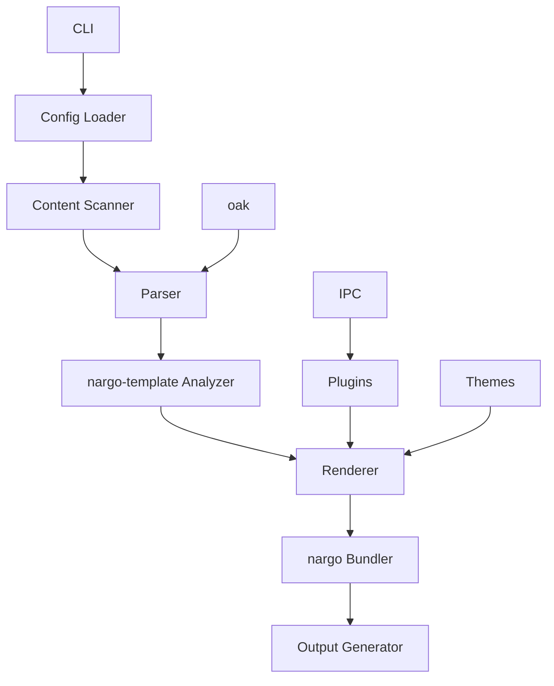

# Rusty SSG 项目概述

## 项目简介

Rusty SSG 是一个高性能、纯 Rust 实现的静态站点生成器集合，旨在提供卓越的速度和与核心功能的完全兼容性。

### 项目目标

- **性能优先**：利用 Rust 的性能特性，实现比原始实现更快的构建速度
- **完全兼容**：保持与原始静态站点生成器的核心功能兼容
- **模块化设计**：采用模块化架构，便于扩展和维护
- **跨平台支持**：支持 Windows、macOS 和 Linux
- **开发者友好**：提供良好的工具和开发体验
- **功能完备**：实现原始静态站点生成器的核心功能

## 核心功能

### 🔧 主要特性

- 🚀 **极致速度**：中等至大型站点的构建速度最高提升 10 倍
- 🎨 **完全兼容**：使用静态功能时保持与原始 SSG 的完全兼容性
- 🔧 **可扩展性**：每个编译器都有插件系统
- 🛠 **开发者友好**：优秀的工具和开发体验
- 📝 **Markdown 支持**：高级 Markdown 解析和渲染
- 🌍 **跨平台**：适用于 Windows、macOS 和 Linux
- 📱 **静态优先**：针对静态站点生成进行优化
- 🔄 **增量构建**：智能缓存系统，仅重建修改的文件
- 📦 **主题系统**：支持可定制的主题
- 🔌 **插件生态**：丰富的插件支持，扩展功能

### 📦 支持的编译器

Rusty SSG 目前包含以下静态站点生成器的 Rust 实现：

1. **Astro**：框架无关的静态站点生成器，支持 React、Vue、Svelte 等
2. **Eleventy**：多模板引擎支持的静态站点生成器
3. **Gatsby**：基于 React 的静态站点生成器，具有 GraphQL 数据层
4. **Hexo**：博客专注的静态站点生成器
5. **Hugo**：快速灵活的静态站点生成器，具有强大的模板系统
6. **Jekyll**：基于 Liquid 模板系统的静态站点生成器
7. **MkDocs**：文档专注的静态站点生成器
8. **VitePress**：基于 Vue 的文档站点生成器
9. **VuePress**：基于 Vue 的静态站点生成器

## 架构设计

### 整体架构

所有编译器都遵循为性能和可扩展性设计的模块化架构：



### 核心组件

1. **CLI**：命令行界面，用于与编译器交互
2. **Config Loader**：读取和解析配置文件
3. **Content Scanner**：发现和处理内容文件
4. **Parser**：将源文件转换为中间表示（使用 oak）
5. **nargo-template Analyzer**：分析内容和模板
6. **Renderer**：将中间表示转换为 HTML
7. **nargo Bundler**：打包和优化输出文件
8. **Output Generator**：写入最终的静态文件
9. **Plugins**：使用自定义插件扩展功能（使用 IPC 模式）
10. **Themes**：提供可重用的模板和样式
11. **oak**：用于解析的外部库
12. **IPC**：插件系统的进程间通信

### 技术栈

- **主要语言**：Rust
- **解析库**：oak（内部开发）
- **模板分析**：nargo-template
- **构建工具**：Cargo
- **包管理**：pnpm workspace
- **测试框架**：Rust 标准测试框架
- **文档格式**：Markdown

## 性能优势

Rusty SSG 编译器在性能方面显著优于原始实现：

- **更快的构建时间**：中等至大型站点的构建速度最高提升 10 倍
- **更低的内存使用**：与原始实现相比，内存使用更低
- **并行处理**：文档的并行处理提高了性能
- **高效缓存**：最小化重建时间
- **增量构建**：智能检测文件变更，仅重建必要的文件
- **优化的 I/O 操作**：减少磁盘访问，提高性能

## 兼容性说明

⚠️ **重要**：Rusty SSG 仅在使用静态功能时提供 100% 的兼容性。动态功能可能支持有限或需要额外配置。

## 项目结构

Rusty SSG 采用 monorepo 结构，每个编译器都有自己的目录：

```
rusty-ssg/
├── compilers/           # 各个编译器的实现
│   ├── astro/          # Astro 编译器
│   ├── eleventy/       # Eleventy 编译器
│   ├── gatsby/         # Gatsby 编译器
│   ├── hexo/           # Hexo 编译器
│   ├── hugo/           # Hugo 编译器
│   ├── jekyll/         # Jekyll 编译器
│   ├── mkdocs/         # MkDocs 编译器
│   ├── vitepress/      # VitePress 编译器
│   └── vuepress/       # VuePress 编译器
├── examples/           # 示例项目
│   ├── hexo-mvp/       # Hexo 最小可行示例
│   ├── hugo-ananke/    # Hugo Ananke 主题示例
│   ├── hugo-blowfish/  # Hugo Blowfish 主题示例
│   ├── hugo-mvp/       # Hugo 最小可行示例
│   ├── jekyll-mvp/     # Jekyll 最小可行示例
│   ├── mkdocs-mvp/     # MkDocs 最小可行示例
│   ├── vitepress-mvp/  # VitePress 最小可行示例
│   └── vuepress-mvp/   # VuePress 最小可行示例
├── benchmarks/         # 性能基准测试
│   ├── documents/      # 测试文档
│   └── src/            # 基准测试代码
├── scripts/            # 辅助脚本
├── test-project/       # 测试项目
└── docs/               # 项目文档
    ├── best-practices/ # 最佳实践指南
    ├── compilers/      # 各编译器文档
    ├── deployment/     # 部署指南
    └── overview/       # 项目概述和架构
```

## 开始使用

### 安装 Rusty SSG

1. **安装 Rust**：确保您已安装 Rust 1.70 或更高版本
2. **克隆仓库**：`git clone https://github.com/doki-land/rusty-ssg.git`
3. **构建项目**：`cd rusty-ssg && cargo build --release`
4. **运行编译器**：`cargo run --bin <compiler-name> -- <command>`

### 快速开始

要开始使用 Rusty SSG，请参考各个编译器的文档：

- [Astro 文档](../compilers/astro/README.md)
- [Hugo 文档](../compilers/hugo/README.md)
- [Eleventy 文档](../compilers/eleventy/README.md)
- [Gatsby 文档](../compilers/gatsby/README.md)
- [Hexo 文档](../compilers/hexo/README.md)
- [Jekyll 文档](../compilers/jekyll/README.md)
- [MkDocs 文档](../compilers/mkdocs/README.md)
- [VitePress 文档](../compilers/vitepress/README.md)
- [VuePress 文档](../compilers/vuepress/README.md)

## 贡献指南

我们欢迎对 Rusty SSG 的贡献！🤝

### 报告问题

如果您发现错误或有功能请求，请 [打开一个 issue](https://github.com/doki-land/rusty-ssg/issues)。

### 提交拉取请求

1. Fork 仓库
2. 创建一个新分支
3. 进行更改
4. 运行测试：`cargo test`
5. 提交拉取请求

### 代码风格

请遵循 Rust 风格指南并使用 `cargo fmt` 格式化代码。

## 性能基准测试

Rusty SSG 包含性能基准测试，用于比较与原始实现的性能差异：

```bash
# 运行基准测试
cd benchmarks
pnpm install
pnpm run benchmark
```

## 致谢

Rusty SSG 受到原始静态站点生成器的启发，并受益于 Rust 生态系统，包括 nargo 和 oak 库。

## 许可证

Rusty SSG 在 AGPL-3.0 许可证下发布。有关更多信息，请参阅 [LICENSE](../../license.md)。

---

使用 Rust 构建 ❤️

祝您静态站点生成愉快！🚀